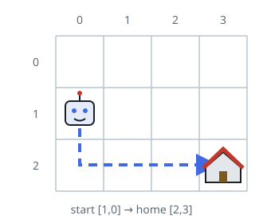

# Cheapest Walk Home on a Toll Grid

## Description

A robot stands somewhere on an `m x n` grid and wants to reach its home
cell. Rows are numbered `0` through `m - 1` from top to bottom and
columns `0` through `n - 1` from left to right. You are given
`startPos = [startrow, startcol]` for the robot's cell and
`homePos = [homerow, homecol]` for its home.

Each step moves one cell up, down, left, or right and never leaves the
grid. Every step charges a toll based on the cell being entered:

- a vertical step into row `r` costs `rowCosts[r]`;
- a horizontal step into column `c` costs `colCosts[c]`.

Return the smallest total toll that can get the robot home.

### Example 1



```text
Input: startPos = [1, 0], homePos = [2, 3], rowCosts = [5, 4, 3], colCosts = [8, 2, 6, 7]
Output: 18
Explanation: One cheap route steps down into row 2, paying rowCosts[2]
= 3, then walks right through columns 1, 2, and 3, paying colCosts[1]
+ colCosts[2] + colCosts[3] = 2 + 6 + 7. The total is 3 + 2 + 6 + 7 = 18.
```

### Example 2

```text
Input: startPos = [0, 2], homePos = [3, 0], rowCosts = [1, 5, 2, 4], colCosts = [3, 7, 1]
Output: 21
Explanation: Walking down enters rows 1, 2, and 3 for 5 + 2 + 4 = 11,
and walking left enters columns 1 and 0 for 7 + 3 = 10, so the trip
costs 21.
```

### Example 3

```text
Input: startPos = [0, 3], homePos = [0, 1], rowCosts = [2], colCosts = [4, 9, 6, 1]
Output: 15
Explanation: The home is on the same row, so the walk is purely
horizontal: entering column 2 costs 6 and entering column 1 costs 9.
```

### Example 4

```text
Input: startPos = [1, 1], homePos = [3, 2], rowCosts = [7, 2, 9, 6], colCosts = [8, 3, 5]
Output: 20
Explanation: Stepping down into rows 2 and 3 costs 9 + 6, and one step
right into column 2 costs 5, for a total of 20.
```

### Constraints

- `rowCosts` has `m` entries and `colCosts` has `n` entries, where
  `1 <= m, n <= 10⁵`.
- `0 <= rowCosts[r], colCosts[c] <= 10⁴`
- `startPos` and `homePos` each hold exactly two indices, both within
  the grid: `0 <= startrow, homerow < m` and `0 <= startcol, homecol < n`.

## Hints

### Hint 1

No matter the route, every row lying between the start row and the home
row must be entered at least once — and likewise every column between
the start and home columns. Those tolls are unavoidable.

### Hint 2

A straight walk toward home collects each forced toll exactly once and
nothing more, and since no toll is negative, every extra step is pure
loss.
