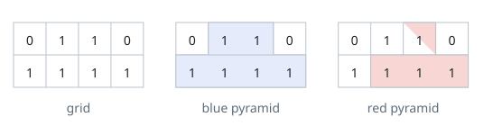
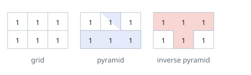
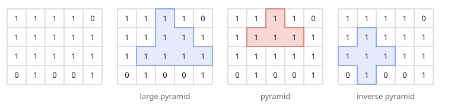

# Pyramid Plots in a Field

## Description

A field is laid out as a grid of `m` rows and `n` columns of unit cells.
Every cell is either fertile, marked `1`, or barren, marked `0`. Any cell
past the field's border is treated as barren.

A pyramid-shaped plot is a group of cells meeting both of these rules:

- The group contains more than one cell, and every cell in it is fertile.
- One cell of the group is the apex — the topmost cell. If the apex sits
  at `(r, c)` and the plot's height is `h`, meaning it spans `h` rows, the
  plot consists of exactly the cells `(i, j)` with `r <= i <= r + h - 1`
  and `c - (i - r) <= j <= c + (i - r)`.

An inverted pyramid-shaped plot obeys the mirror-image rules:

- The group contains more than one cell, and every cell in it is fertile.
- The apex is the bottommost cell. If the apex sits at `(r, c)` and the
  plot's height is `h`, the plot consists of exactly the cells `(i, j)`
  with `r - h + 1 <= i <= r` and `c - (r - i) <= j <= c + (r - i)`.


Given the 0-indexed `m x n` binary matrix `grid` describing the field,
return the total number of pyramid-shaped and inverted pyramid-shaped
plots it contains.

### Example 1



```text
Input: grid = [[0,1,1,0],[1,1,1,1]]
Output: 2
Explanation: Two pyramid-shaped plots fit in this field, and no
inverted pyramid-shaped plot does, so the answer is 2 + 0 = 2.
```

### Example 2



```text
Input: grid = [[1,1,1],[1,1,1]]
Output: 2
Explanation: The field holds one pyramid-shaped plot and one inverted
pyramid-shaped plot, giving 1 + 1 = 2.
```

### Example 3



```text
Input: grid = [[1,1,1,1,0],[1,1,1,1,1],[1,1,1,1,1],[0,1,0,0,1]]
Output: 13
Explanation: Counting both orientations gives 7 pyramid-shaped plots
and 6 inverted pyramid-shaped plots, so the answer is 7 + 6 = 13.
```

### Example 4

```text
Input: grid = [[1,1,0,0],[0,1,1,0],[1,1,1,1]]
Output: 2
Explanation: The bottom row is fertile all the way across, so each of
the two single-row apexes above it that stays inside fertile ground
forms one pyramid-shaped plot; nothing points the other way, so the
total is 2.
```

### Constraints

- `m == grid.length`
- `n == grid[i].length`
- `1 <= m, n <= 1000`
- `1 <= m * n <= 10⁵`
- `grid[i][j]` is `0` or `1`.

## Hints

### Hint 1

Dynamic programming over the grid's rows is a natural fit here.

### Hint 2

For a fixed cell `(r, c)`, try to work out the tallest plot that has
`(r, c)` as its apex; call that value `dp[r][c]`.

### Hint 3

How do `dp[r+1][c-1]` and `dp[r+1][c+1]`, the two diagonal neighbors
further along, bound the value of `dp[r][c]`?

### Hint 4

For the cell `(r, c)`, what does `dp[r][c]` tell you about how many
plots have their apex there, and how do those counts combine into the
final answer?
