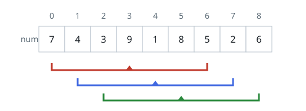

# Window Averages Around Each Index

## Description

You are given a 0-indexed array `nums` holding `n` integers, plus an
integer `k`.

For an index `i`, the radius-`k` window average is the mean of every
element from index `i - k` through index `i + k`, both ends included.
When fewer than `k` elements exist on either side of `i`, the window
does not fit, and the radius-`k` window average for that index is `-1`.

Assemble an array `avgs` of length `n` in which `avgs[i]` holds the
radius-`k` window average centered at index `i`.

The mean of `x` values is their sum divided by `x` using integer
division, and that division truncates toward zero — the fractional part
is simply dropped. For instance, the mean of the four values `2`, `3`,
`1`, and `5` works out to `(2 + 3 + 1 + 5) / 4 = 11 / 4 = 2.75`, which
truncates to `2`.

### Example 1



```text
Input: nums = [7,4,3,9,1,8,5,2,6], k = 3
Output: [-1,-1,-1,5,4,4,-1,-1,-1]
Explanation:
- Indices 0, 1 and 2 each lack k elements on their left, and indices
  6, 7 and 8 each lack k on their right, so those entries are -1.
- The window centered at index 3 spans 7 + 4 + 3 + 9 + 1 + 8 + 5 = 37,
  and 37 / 7 truncates to 5.
- Centered at index 4 the window sums to (4 + 3 + 9 + 1 + 8 + 5 + 2),
  giving 4 after truncation, and index 5 also gives 4.
```

### Example 2

```text
Input: nums = [2,6,1,8,4], k = 1
Output: [-1,3,5,4,-1]
Explanation: Each interior index averages itself with its two
neighbors: (2 + 6 + 1) / 3 = 3, (6 + 1 + 8) / 3 = 5 and
(1 + 8 + 4) / 3 = 4. The two end indices have no element on one side,
so they report -1.
```

### Example 3

```text
Input: nums = [3,1,9,2,7], k = 2
Output: [-1,-1,4,-1,-1]
Explanation: Only index 2 has two elements on both sides. Its window
holds 3 + 1 + 9 + 2 + 7 = 22, and 22 / 5 truncates to 4.
```

### Example 4

```text
Input: nums = [9,4], k = 0
Output: [9,4]
Explanation: A radius of 0 makes each window a single element, so
every index averages to itself.
```

### Constraints

- `n == nums.length`
- `1 <= n <= 10⁵`
- `0 <= nums[i], k <= 10⁵`

## Hints

### Hint 1

A window average only needs the window's sum, since the element count
follows from `k`. How can each successive window's sum be obtained
cheaply?

### Hint 2

Keep a running sum that slides one position at a time: adding the
element entering the window and subtracting the one leaving it.

### Hint 3

The total of a large window can overflow a 32-bit integer, so hold the
running sum in a 64-bit type.
