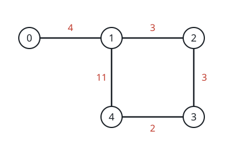
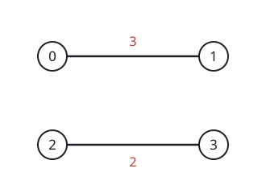

# Cheapest Route with Toll Vouchers

## Description

A network of highways links `n` cities numbered `0` through `n - 1`.
You are given a 2D integer array `highways` in which
`highways[i] = [city1ᵢ, city2ᵢ, tollᵢ]` describes a highway joining
`city1ᵢ` and `city2ᵢ`; a car may drive it in either direction at a cost
of `tollᵢ`.

Alongside the roads you hold an integer `discounts`, the number of
voucher trips you own. Spending a voucher on a highway cuts that
crossing to `tollᵢ / 2` using integer division. Every voucher works
only once, and a single highway crossing can absorb at most one
voucher.

Return the smallest total cost of a drive from city `0` to city
`n - 1`, or `-1` when no sequence of highways connects the two.

### Example 1



```text
Input: n = 5, highways = [[0,1,4],[2,1,3],[1,4,11],[3,2,3],[3,4,2]], discounts = 1
Output: 9
Explanation:
Drive from 0 to 1 at full toll, 4.
Then take the highway from 1 to 4 and spend the voucher there,
paying 11 / 2 = 5.
The cheapest possible trip from 0 to 4 therefore costs 4 + 5 = 9.
```

### Example 2


```text
Input: n = 4, highways = [[1,3,17],[1,2,7],[3,2,5],[0,1,6],[3,0,20]], discounts = 20
Output: 8
Explanation:
Vouchers are plentiful, so spend them on the three short hops:
0 to 1 costs 6 / 2 = 3, 1 to 2 costs 7 / 2 = 3, and 2 to 3 costs
5 / 2 = 2, for a total of 3 + 3 + 2 = 8.
```

### Example 3



```text
Input: n = 4, highways = [[0,1,3],[2,3,2]], discounts = 0
Output: -1
Explanation: No chain of highways joins city 0 to city 3, so the trip
cannot be made.
```

### Example 4

```text
Input: n = 3, highways = [[0,1,7],[1,2,5]], discounts = 3
Output: 5
Explanation: Voucher a toll of 7 and you pay 7 / 2 = 3; voucher a toll
of 5 and you pay 5 / 2 = 2. Spending one voucher on each highway
totals 5, and the third voucher simply goes unused.
```

### Constraints

- `2 <= n <= 1000`
- `1 <= highways.length <= 1000`
- `highways[i].length == 3`
- `0 <= city1ᵢ, city2ᵢ <= n - 1`
- `city1ᵢ != city2ᵢ`
- `0 <= tollᵢ <= 10⁵`
- `0 <= discounts <= 500`
- No highway appears more than once.

## Hints

### Hint 1

Turn the highways into a graph first. What kind of graph do you get?

### Hint 2

The task reduces to finding a cheapest path between node `0` and node
`n - 1` in an undirected weighted graph — which classic algorithm
applies?

### Hint 3

Run Dijkstra over an expanded state: a city together with how many
vouchers have already been spent, so each vertex keeps one distance
per remaining-voucher count.
