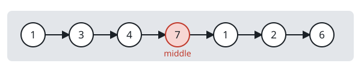
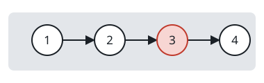
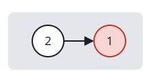

# Unlink the Middle Node

## Description

You are given the head of a linked list. Remove its middle node and return the
head of the list that remains.

For a list holding `n` nodes, the middle node is the one at index `⌊n / 2⌋`,
counted from `0` at the head. Reading `n = 1` through `n = 5`, that index is
`0`, `1`, `1`, `2`, `2`.

### Example 1



```text
Input: head = [1,3,4,7,1,2,6]
Output: [1,3,4,1,2,6]
Explanation: The list holds 7 nodes, so index 3 — the node holding 7 — is the
middle. Deleting it leaves the six-node list in the output.
```

### Example 2



```text
Input: head = [1,2,3,4]
Output: [1,2,4]
Explanation: With 4 nodes the middle index is 2, so the node holding 3 goes.
```

### Example 3



```text
Input: head = [2,1]
Output: [2]
Explanation: With 2 nodes the middle index is 1, so the lone survivor is the
node holding 2.
```

### Constraints

- The number of nodes in the list is in the range `[1, 10⁵]`.
- `1 <= Node.val <= 10⁵`

## Hints

### Hint 1

Two travelers can share the work: when one covers two nodes for every one the
other covers, the slower stands immediately before the middle by the time the
faster runs out of list.

### Hint 2

Deleting a node only ever requires its predecessor — rewiring a single `next`
pointer past the middle is the entire operation. A dummy node in front of the
head keeps the one-node list from being a special case.
