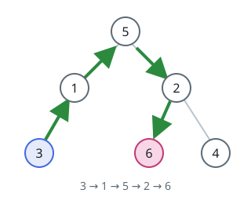
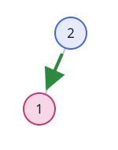

# Walking Directions Through a Tree

## Description

You are given the `root` of a binary tree whose `n` nodes carry the distinct
values `1` through `n`. Two of those values pick out a start node `s`, given
as `startValue`, and a destination node `t`, given as `destValue`; the two are
guaranteed different.

Describe a shortest route from `s` to `t` as a string written over three
moves:

- `'L'` — step down into the current node's left child.
- `'R'` — step down into the current node's right child.
- `'U'` — step up to the current node's parent.

Return the direction string of a shortest path from `s` to `t`.

### Example 1



```text
Input: root = [5,1,2,3,null,6,4], startValue = 3, destValue = 6
Output: "UURL"
Explanation: The route climbs from 3 to 1 and onward to their ancestor 5,
then descends through 2 into 6 — up, up, right, left.
```

### Example 2



```text
Input: root = [2,1], startValue = 2, destValue = 1
Output: "L"
Explanation: The destination is the start node's left child, so a single
'L' covers the whole journey.
```

### Constraints

- The tree holds `n` nodes, where `2 <= n <= 10⁵`.
- `1 <= Node.val <= n`, and every value in the tree is distinct.
- `1 <= startValue, destValue <= n` with `startValue != destValue`.

## Hints

### Hint 1

A tree admits exactly one simple route between two nodes, and it bends at
their lowest common ancestor: climb from `s` up to that ancestor, then
descend to `t`.

### Hint 2

Write down the move strings from the root to `s` and from the root to `t`.
What does their longest common prefix reveal?

### Hint 3

Strip that prefix — the remainders are the two arms hanging below the common
ancestor. Turn every letter of the `s`-side remainder into `'U'` and append
the `t`-side remainder unchanged.
