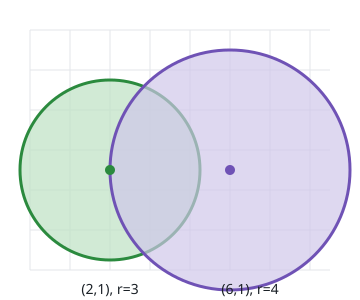
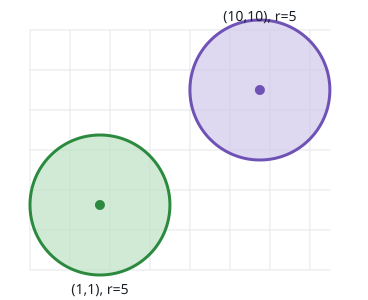
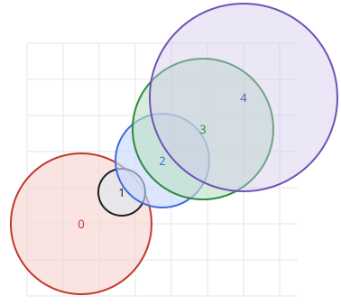

# Longest Bomb Chain

## Description

A row of explosive devices sits at integer points, each carrying its own
blast radius. Device `i` is given by `bombs[i] = [xi, yi, ri]`: it rests at
`(xi, yi)` and spans a circle of radius `ri` centered there.

You may ignite exactly one device. When a device explodes, every device
whose center lies inside or on its circle explodes as well — and reach is
one-directional, so a device caught in a larger blast may be unable to
blast back. Each fresh explosion repeats this over everything still intact
in its range.

Numbering devices from `0`, return the largest total number of devices
that can end up destroyed, over all choices of the device you ignite.

### Example 1



```text
Input: bombs = [[2,1,3],[6,1,4]]
Output: 2
Explanation:
The device on the left cannot reach the one on the right, but the right
device's circle covers the left one. Igniting the right device destroys
both, so the answer is 2.
```

### Example 2



```text
Input: bombs = [[1,1,5],[10,10,5]]
Output: 1
Explanation:
Neither device reaches the other, so only the device you ignite is
destroyed.
```

### Example 3



```text
Input: bombs = [[1,2,3],[2,3,1],[3,4,2],[4,5,3],[5,6,4]]
Output: 5
Explanation:
Igniting device 0 destroys devices 1 and 2; device 2 then reaches
device 3, and device 3 reaches device 4. The entire set of five goes off.
```

### Constraints

- `1 <= bombs.length <= 100`
- `bombs[i].length == 3`
- `1 <= xi, yi, ri <= 10⁵`

## Hints

### Hint 1

Treat each device as a node. Ask yourself when one node should point at
another.

### Hint 2

Add a directed edge `i -> j` exactly when device `j`'s center fits inside
device `i`'s circle. The relation is generally not symmetric.

### Hint 3

Everything a chosen starting device destroys is precisely the set of nodes
reachable from it in this graph.

### Hint 4

Run a traversal from every possible starting device and keep the largest
count of reached nodes. Comparing squared distances in integer arithmetic
keeps the edge test exact.
