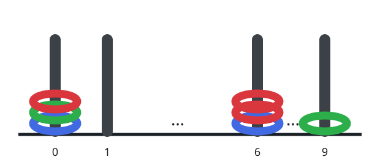
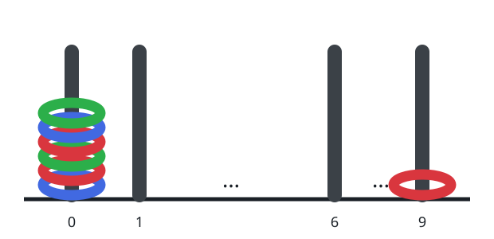

# Rods With Every Color

## Description

Ten posts stand in a row, labeled `0` through `9`. A batch of rings, each
colored red, green, or blue, is threaded onto them, and the whole
placement arrives as one string: read it two characters at a time, where
each pair describes a single ring —

- the first character is the ring's color: `'R'`, `'G'`, or `'B'`;
- the second character is the label of the post the ring is threaded on:
  a digit `'0'` through `'9'`.

For instance, `"R3G2B1"` describes three rings: a red one on post `3`, a
green one on post `2`, and a blue one on post `1`.

Return how many posts end up holding at least one ring of every color.

### Example 1



```text
Input: rings = "B0B6G0R6R0R6G9"
Output: 1
Explanation:
Post 0 collects a red, a green, and a blue ring — every color at once.
Post 6 holds red and blue only, and post 9 holds just a green ring.
So exactly one post carries all three colors.
```

### Example 2



```text
Input: rings = "B0R0G0R9R0B0G0"
Output: 1
Explanation:
Post 0 gathers six rings spanning all three colors, while post 9 holds a
single red ring. One post qualifies.
```

### Example 3

```text
Input: rings = "R1G1B1R8B8G8B3"
Output: 2
Explanation:
Posts 1 and 8 each hold all three colors; post 3 holds only a blue ring.
The answer is 2.
```

### Constraints

- `rings.length == 2 * n`
- `1 <= n <= 100`
- Every character at an even index is `'R'`, `'G'`, or `'B'`.
- Every character at an odd index is a digit `'0'` through `'9'`.

## Hints

### Hint 1

Walk the string in pairs and record, for each post, which colors have
landed on it.

### Hint 2

A three-bit mask per post works well: set one bit per color as pairs are
read, then count the posts whose mask ended up with all three bits on.
