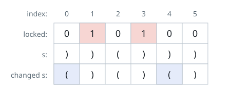

# Can the Bracket String Be Balanced

## Description

A string built only from the characters `'('` and `')'` is called balanced
when one of the following holds:

- It is exactly `()`.
- It can be split as `AB`, where `A` and `B` are both balanced strings.
- It can be wrapped as `(A)`, where `A` is a balanced string.

You are given such a string `s` and a binary string `locked`, both of length
`n`. Each position obeys its lock:

- `locked[i] == '1'` freezes position `i`; the character `s[i]` must stay.
- `locked[i] == '0'` leaves position `i` free; you may set `s[i]` to either
  bracket.

Decide whether the free positions can be filled so that `s` ends up balanced.

### Example 1



```text
Input: s = "))()))", locked = "010100"
Output: true
Explanation: Positions 1 and 3 are frozen, and the free spots at 0 and 4 can
be turned into openers, leaving 2 and 5 as they are. The result balances.
```

### Example 2

```text
Input: s = ")()(", locked = "0010"
Output: true
Explanation: Positions 0, 1 and 3 are free; position 2 keeps its ')'.
Setting the free positions to '(', '(' and ')' produces "(())", which is
balanced.
```

### Example 3

```text
Input: s = "(", locked = "0"
Output: false
Explanation: The position is free, but a one-character string can never
balance: a valid string needs pairs.
```

### Example 4

```text
Input: s = "())(", locked = "1011"
Output: false
Explanation: Position 0 is a frozen ')' with nothing to its left that could
match it, so no assignment works.
```

### Constraints

- `n == s.length == locked.length`
- `1 <= n <= 10⁵`
- `s[i]` is either `'('` or `')'`.
- `locked[i]` is either `'0'` or `'1'`.

## Hints

### Hint 1

How many characters does a balanced string need? Any odd-length input can be
rejected straight away.

### Hint 2

Sweep left to right, tracking the smallest and the largest number of
unmatched openers the prefix could possibly have. A frozen character moves
the two bounds together; a free position can lower the smallest count or
raise the largest one. If the largest count ever sinks below zero, some
frozen ')' is already unfixable.

### Hint 3

A negative smallest count is never worth keeping — clamp it to zero, since
you would not deliberately leave an opener unmatched. Once the sweep is done
on an even-length string, it can be balanced exactly when zero is still
within the reachable range.
