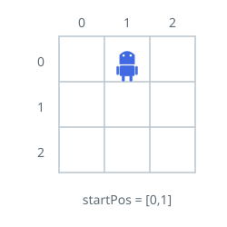
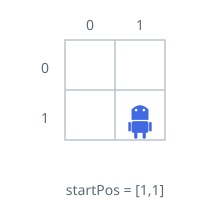
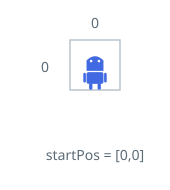

# Robot Suffix Walks

## Description

A robot wanders an `n x n` grid whose cells are addressed from `(0, 0)` in
the top-left corner down to `(n - 1, n - 1)` in the bottom-right. The robot
begins on the cell `startPos = [startrow, startcol]`.

You also receive a command string `s` of length `m`. Each character is one
step: `'L'` shifts a column left, `'R'` a column right, `'U'` a row up, and
`'D'` a row down.

The robot performs the walk that starts at any chosen character `s[i]` and
plays the characters of that suffix in order. The walk ends early — before
executing a character — the moment that step would carry the robot off the
grid; otherwise it continues through the end of the string.

Build an array of length `m` whose `i`-th entry is how many characters the
robot actually executes when the walk starts at `s[i]`.

### Example 1



```text
Input: n = 3, startPos = [0,1], s = "RRDDLU"
Output: [1,5,4,3,1,0]
Explanation: Per starting index, the executed prefix of each suffix:
- 0th: "RRDDLU". The first "R" walks off the grid's right edge, so only 1
  command runs.
- 1st:  "RDDLU". Every command fits; the robot finishes at (1, 1). Count 5.
- 2nd:   "DDLU". All four commands fit and the robot ends at (1, 0).
- 3rd:    "DLU". All three commands fit and the robot ends at (0, 0).
- 4th:     "LU". The "L" steps off the left edge after 1 command.
- 5th:      "U". Row 0's upward neighbor is outside, so nothing runs.
```

### Example 2



```text
Input: n = 2, startPos = [1,1], s = "LURD"
Output: [4,1,0,0]
Explanation:
- 0th: "LURD".
- 1st:  "URD".
- 2nd:   "RD".
- 3rd:    "D".
```

### Example 3



```text
Input: n = 1, startPos = [0,0], s = "LRUD"
Output: [0,0,0,0]
Explanation: On a single-cell grid every command leaves the grid, so each
walk executes nothing.
```

### Example 4

```text
Input: n = 4, startPos = [1,2], s = "DLLURRU"
Output: [7,5,4,2,1,2,1]
Explanation: The walk from index 0 completes all seven commands and stops at
(0, 2). Later walks lose their opening moves: the one from index 4 executes
only its "R" because the following "R" would leave the top row, while the
walk from index 5 still fits its "RU" pair.
```

### Constraints

- `m == s.length`
- `1 <= n, m <= 500`
- `startPos.length == 2`
- `0 <= startrow, startcol < n`
- `s` contains only the characters `'L'`, `'R'`, `'U'`, and `'D'`.

## Hints

### Hint 1

Both dimensions cap at 500, so replaying every suffix from its own fresh
start costs at most a few hundred thousand steps — direct simulation fits
easily.

### Hint 2

For a fixed start, apply each character's row/column delta in turn; the
first character whose destination cell falls outside `[0, n)` cuts the walk,
and the number of characters applied so far is that start's answer.
