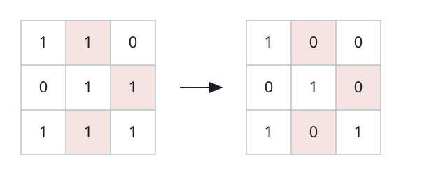
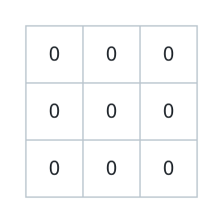
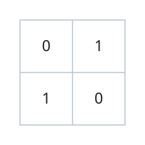

# Fewest Flips to Isolate the Ones

## Description

You receive a binary matrix `grid`. A single operation picks any cell
holding a `1` and flips it to `0`.

Call the matrix isolated when no two `1`s remain side by side — sharing an
edge horizontally or vertically is forbidden, though diagonals are fine.

Flips cost one each, so make the matrix isolated while flipping as few
cells as possible, and report that smallest count.

### Example 1



```text
Input: grid = [[1,1,0],[0,1,1],[1,1,1]]
Output: 3
Explanation: Flip grid[0][1], grid[1][2], and grid[2][1] to 0. Afterward
every remaining 1 stands alone and the matrix is isolated.
```

### Example 2



```text
Input: grid = [[0,0,0],[0,0,0],[0,0,0]]
Output: 0
Explanation: With no 1s at all there is nothing to separate, so the matrix
is already isolated and the answer is 0.
```

### Example 3



```text
Input: grid = [[0,1],[1,0]]
Output: 0
Explanation: The two 1s touch only diagonally, which is allowed, so no
flip is needed.
```

### Example 4

```text
Input: grid = [[1,0,1],[1,1,0],[0,1,1]]
Output: 2
Explanation: Four edge-touching pairs exist. Flipping grid[1][0] and
grid[2][1] breaks all of them at once — each pair contains one of those
two cells — and two is the least any flip set can achieve.
```

### Constraints

- `m == grid.length`
- `n == grid[i].length`
- `1 <= m, n <= 300`
- Every `grid[i][j]` is `0` or `1`.

## Hints

### Hint 1

Give each `1`-cell the role of a graph vertex and join two vertices when
their cells share an edge. Row-plus-column parity colors the vertices into
two independent sides — the graph is bipartite.

### Hint 2

Every flip removes a vertex, and the matrix is isolated exactly when the
removed vertices touch every edge. The cheapest such set is a classic
object; recall what König's theorem says about its size.

### Hint 3

The smallest set of vertices covering all edges has the same size as the
largest matching, and in a bipartite graph that matching can be found fast.

### Hint 4

Link each even-parity cell to its adjacent odd-parity cells and run a
maximum-matching algorithm such as Hopcroft–Karp; the matched-pair count
is the answer.
