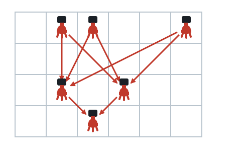
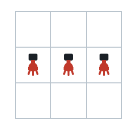

# Beams Across Empty Floors

## Description

A guarded building is modeled as an `m x n` grid of cells, given as the
array `floors` of binary strings: `floors[i]` spells out row `i`, where
`'1'` marks a cell holding a sensor and `'0'` marks an empty cell.

A laser beam links two sensors when both of these hold:

- The sensors sit on different rows `r1` and `r2` with `r1 < r2`.
- Every row strictly between them is completely empty of sensors.

Beams do not interact with one another, so any qualifying pair contributes
its own beam. Count all the beams in the building.

### Example 1



```text
Input: floors = ["011001","000000","010100","001000"]
Output: 8
Explanation: Each of these pairs carries one beam, for 8 in total:
 * floors[0][1] -- floors[2][1]
 * floors[0][1] -- floors[2][3]
 * floors[0][2] -- floors[2][1]
 * floors[0][2] -- floors[2][3]
 * floors[0][5] -- floors[2][1]
 * floors[0][5] -- floors[2][3]
 * floors[2][1] -- floors[3][2]
 * floors[2][3] -- floors[3][2]
No sensor on row 0 reaches row 3, because the sensors in row 2 block the
way.
```

### Example 2



```text
Input: floors = ["000","111","000"]
Output: 0
Explanation: All the sensors share one row, and a beam needs two different
rows, so nothing is counted.
```

### Example 3

```text
Input: floors = ["11","00","111"]
Output: 6
Explanation: The empty row between them does not block anything, so each
of the 2 sensors on the top row beams each of the 3 sensors on the bottom
row: 2 * 3 = 6 beams.
```

### Constraints

- `m == floors.length`
- `n == floors[i].length`
- `1 <= m, n <= 500`
- Each character in `floors[i]` is `'0'` or `'1'`.

## Hints

### Hint 1

Sensors sharing a row behave identically toward the rest of the building —
only how many of them there are matters.

### Hint 2

Every sensor in one row fires one beam at every sensor in the next
sensor-bearing row below it.

### Hint 3

Collapse the grid to the sequence of per-row sensor counts and ignore the
zero entries; the problem becomes purely numeric.

### Hint 4

Sum the products of consecutive surviving counts: an empty row neither
adds beams nor interrupts them, while a row with sensors does interrupt
everything beyond it.
