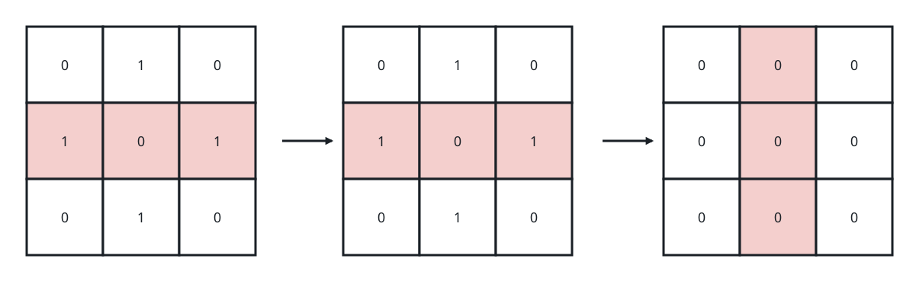
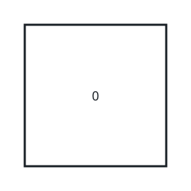

# Zeroing the Grid With Line Flips

## Description

You hold an `m x n` matrix `grid` whose cells are only `0`s and `1`s.

One move consists of picking a single row or a single column and toggling
every cell on that line — each `0` along it becomes `1`, and each `1`
becomes `0`.

Decide whether some sequence of such moves, however long, can leave the
whole matrix filled with `0`s. Return `true` if it can and `false`
otherwise.

### Example 1



```text
Input: grid = [[0,1,0],[1,0,1],[0,1,0]]
Output: true
Explanation: Two moves are enough:
- Toggle the middle row
- Then toggle the middle column
```

### Example 2


```text
Input: grid = [[1,1,0],[0,0,0],[0,0,0]]
Output: false
Explanation: No sequence of row and column toggles can clear this grid.
```

### Example 3



```text
Input: grid = [[0]]
Output: true
Explanation: The grid already holds nothing but zeros.
```

### Constraints

- `m == grid.length`
- `n == grid[i].length`
- `1 <= m, n <= 300`
- Every entry of `grid` is `0` or `1`.

## Hints

### Hint 1

Think about whether the sequence in which you toggle lines could change the
outcome.

### Hint 2

It cannot: a cell is inverted exactly when an odd number of its row/column
toggles touch it. Consequently toggling the same line twice — or any even
number of times — accomplishes nothing.

### Hint 3

Work in reverse: begin from an all-zero matrix and ask which grids can be
produced by these toggles.

### Hint 4

Do the column toggles first. After them, look at how the rows relate to
each other.

### Hint 5

Every row is now identical, and the later row toggles can only leave a row
as it is or invert it entirely.
