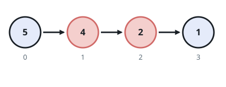
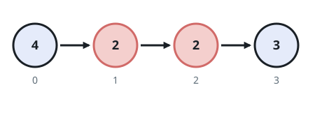
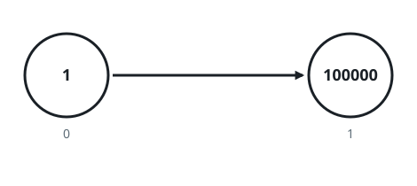

# Mirror Pairs in a List

## Description

Take a linked list holding an even number `n` of nodes. Two of its nodes
form a mirror pair when their positions read the same distance from opposite
ends: the node at index `i` pairs with the node at index `n - 1 - i`, for
`0 <= i <= (n / 2) - 1`.

- With `n = 4`, for instance, index `0` mirrors index `3` and index `1`
  mirrors index `2`; no other nodes are involved in a pair.

A pair's value is simply the sum of the two node values in it.

Given the head of such an even-length list, return the largest pair value
that occurs.

### Example 1



```text
Input: head = [5,4,2,1]
Output: 6
Explanation: Index 0 pairs with index 3 and index 1 pairs with index 2.
Both pairs here add up to 6, and no other pairs exist, so the largest pair
value is 6.
```

### Example 2



```text
Input: head = [4,2,2,3]
Output: 7
Explanation: The pairs are:
- Index 0 with index 3: 4 + 3 = 7.
- Index 1 with index 2: 2 + 2 = 4.
The larger of the two is 7.
```

### Example 3



```text
Input: head = [1,100000]
Output: 100001
Explanation: A two-node list has a single pair, and its value is
1 + 100000 = 100001.
```

### Constraints

- The list contains an even number of nodes, in the range `[2, 10⁵]`.
- `1 <= Node.val <= 10⁵`

## Hints

### Hint 1

Could reversing a section of the list bring each node face to face with its
partner?

### Hint 2

Every node of the first half partners with one in the second half, so split
the list down the middle and reverse the second half.

### Hint 3

Two pointers can then collect every pair value in one sweep.

### Hint 4

Park one pointer at the head of the original first half and one at the head
of the reversed half — that second pointer sits on the `(n-1-i)`-th node.
Advance both together and record each sum you see.
