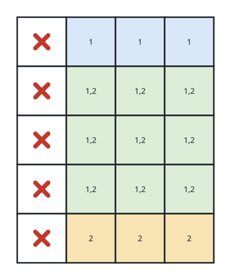
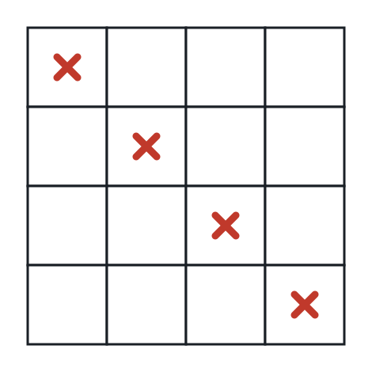

# Blanketing the Grid With Stamps

## Description

You hold an `m x n` binary matrix `grid`; a cell is `0` when it is bare and
`1` when something already sits there.

You also own an unlimited supply of rectangular stamps measuring
`stampHeight x stampWidth`. A stamp may be pressed onto the grid only while
respecting every rule below:

- Between the pressings, all bare cells must end up inked.
- A stamp may never land on an occupied cell.
- Any number of stamps may be used.
- Two stamps may overlap one another.
- Stamps cannot be rotated; they keep the given shape.
- Every stamp must lie wholly within the grid.

Return `true` when some set of presses inks every bare cell under these
rules, and `false` when it cannot be done.

### Example 1



```text
Input: grid = [[1,0,0,0],[1,0,0,0],[1,0,0,0],[1,0,0,0],[1,0,0,0]], stampHeight = 4, stampWidth = 3
Output: true
Explanation: Two overlapping presses (marked 1 and 2 in the picture) ink
every bare cell without ever touching an occupied one.
```

### Example 2



```text
Input: grid = [[1,0,0,0],[0,1,0,0],[0,0,1,0],[0,0,0,1]], stampHeight = 2, stampWidth = 2
Output: false
Explanation: No legal placement pattern exists here — every attempt would
either cross an occupied cell or poke outside the grid.
```

### Constraints

- `m == grid.length`
- `n == grid[r].length`
- `1 <= m, n <= 10⁵`
- `1 <= m * n <= 2 * 10⁵`
- Every entry of `grid` is `0` or `1`.
- `1 <= stampHeight, stampWidth <= 10⁵`

## Hints

### Hint 1

A summed-area table (2-D prefix sums) lets you test any stamp-sized
rectangle in constant time.

### Hint 2

Mark every placement that contains no occupied cell, then ask for each bare
cell whether at least one such placement reached it — a second difference
array pass answers that for the whole grid at once.
