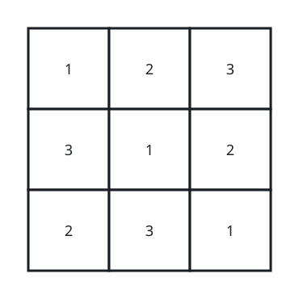
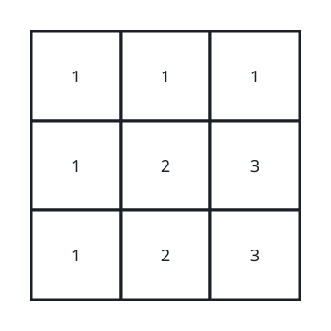

# Is the Grid a Latin Square

## Description

Puzzle setters have a name for a square grid whose rows and columns each
spell out the same run of symbols exactly once: a Latin square. You are
given an `n x n` grid of integers where every entry lies between `1` and
`n`. Decide whether the grid has that Latin-square shape — every one of
the `n` rows and every one of the `n` columns must contain each integer
from `1` through `n` (inclusive). Return `true` when it does and `false`
as soon as any row or column falls short.

### Example 1



```text
Input: matrix = [[1,2,3],[3,1,2],[2,3,1]]
Output: true
Explanation: Here n = 3. Read any row or any column and you meet 1, 2,
and 3 in some order, so the grid qualifies.
```

### Example 2



```text
Input: matrix = [[1,1,1],[1,2,3],[1,2,3]]
Output: false
Explanation: Again n = 3, but the top row repeats 1 three times and the
leftmost column never offers a 2 or a 3, so the grid is rejected.
```

### Constraints

- `n == matrix.length == matrix[i].length`
- `1 <= n <= 100`
- `1 <= matrix[i][j] <= n`

## Hints

### Hint 1

Walk the grid one index at a time and inspect that row and that column
together, since a single pass can settle both.

### Hint 2

For each line you inspect, record which values have appeared; a length-`n`
line drawn from `1..n` is complete exactly when no value shows up twice.
