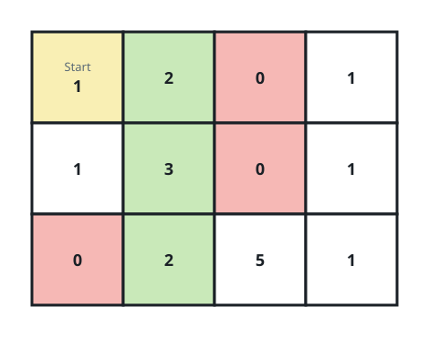
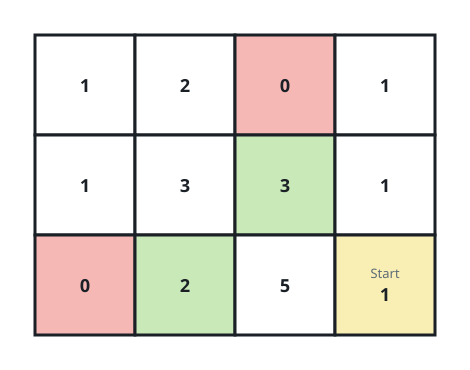
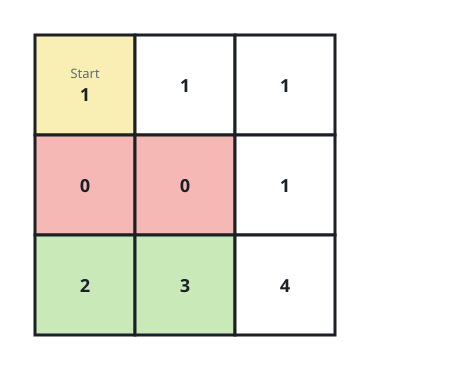

# Best Bargains Within Walking Distance

## Description

A shop floor is laid out as a 0-indexed `m x n` grid of integers:

- `0` marks a wall, a cell you can never set foot in.
- `1` marks open floor you may walk across freely.
- every larger value is the price of an item sitting on that cell, and
  item cells may be walked through just like open floor.

Stepping between two horizontally or vertically adjacent cells costs one
step.

You are given an array `pricing = [low, high]`, a starting cell
`start = [row, col]`, and an integer `k`. Only items priced inside the
inclusive band `[low, high]` interest you, and they compete on the first
of these criteria where they differ:

- walking distance — the length of the shortest path from `start`
  (closer ranks higher);
- price — cheaper ranks higher;
- row — the smaller row number ranks higher;
- column — the smaller column number ranks higher.

Return the positions of the `k` best-ranked in-range items, ordered from
best rank downward. If fewer than `k` such items are reachable, return
all of them.

### Example 1



```text
Input: grid = [[1,2,0,1],[1,3,0,1],[0,2,5,1]], pricing = [2,5], start = [0,0], k = 3
Output: [[0,1],[1,1],[2,1]]
Explanation: Setting out from (0,0), the items priced 2 through 5 sit at
(0,1), (1,1), (2,1), and (2,2), reached after 1, 2, 3, and 4 steps.
Distance alone already separates them, so the closest three are returned.
```

### Example 2



```text
Input: grid = [[1,2,0,1],[1,3,3,1],[0,2,5,1]], pricing = [2,3], start = [2,3], k = 2
Output: [[2,1],[1,2]]
Explanation: From (2,3), the in-range items at (2,1) and (1,2) are both 2
steps away, so price breaks the tie: the 2-priced (2,1) outranks the
3-priced (1,2). The remaining candidates sit farther off.
```

### Example 3



```text
Input: grid = [[1,1,1],[0,0,1],[2,3,4]], pricing = [2,3], start = [0,0], k = 3
Output: [[2,1],[2,0]]
Explanation: The walls force a long detour: the in-range items are
reached after 5 steps at (2,1) and 6 steps at (2,0). Although `k` is 3,
only two qualifying items exist, so both are returned.
```

### Constraints

- `m == grid.length`
- `n == grid[i].length`
- `1 <= m, n <= 10⁵`
- `1 <= m * n <= 10⁵`
- `0 <= grid[i][j] <= 10⁵`
- `pricing.length == 2`
- `2 <= low <= high <= 10⁵`
- `start.length == 2`
- `0 <= row <= m - 1`
- `0 <= col <= n - 1`
- `grid[row][col] > 0`
- `1 <= k <= m * n`

## Hints

### Hint 1

One sweep of the floor can attach a rank to every item — what ordering
does a breadth-first walk out of `start` hand you for free?

### Hint 2

Breadth-first search from the starting cell reveals shortest distances
level by level; gather every in-range item together with its tuple as you
go.

### Hint 3

Sorting the collected `(distance, price, row, column)` tuples settles
every tie-breaker at once — the answer is simply the first `k`.
