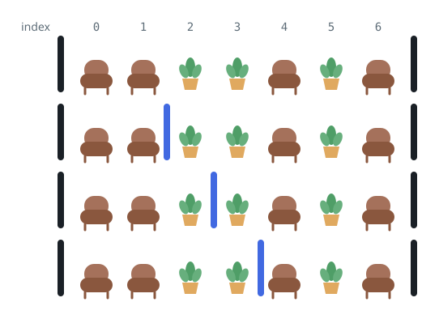
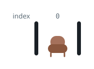

# Hallway Dividers Between Seat Pairs

## Description

Down a long hallway runs a row of seats and potted plants. You are given
a 0-indexed string `corridor` of length `n` made up only of the letters
`S` and `P`: each `S` is a seat, each `P` a plant.

Dividers already stand just left of index `0` and just right of index
`n - 1`, and you may raise more: for each position between indices `i - 1`
and `i` (`1 <= i <= n - 1`), at most one additional divider fits.

Wall the hallway off into consecutive sections so that every section
contains exactly two seats, with any number of plants. Several placements
may work, and two count as different whenever some gap has a divider in
one placement but not in the other.

Return the number of possible placements, modulo `10⁹ + 7`. If no
placement works, return `0`.

### Example 1



```text
Input: corridor = "SSPPSPS"
Output: 3
Explanation: Every section must close around a pair of seats. The three
placements shown each manage it, differing only in which gaps the extra
dividers occupy.
```

### Example 2


```text
Input: corridor = "PPSPSP"
Output: 1
Explanation: With exactly two seats the whole hallway is one section, so
raising any divider at all would split it incorrectly. Doing nothing is
the only valid placement.
```

### Example 3



```text
Input: corridor = "S"
Output: 0
Explanation: A lone seat can never be paired, so no placement exists.
```

### Constraints

- `n == corridor.length`
- `1 <= n <= 10⁵`
- `corridor[i]` is either 'S' or 'P'.

## Hints

### Hint 1

Sections tile the hallway in order and each holds two seats, so the seats
pair up as they appear — first two, next two, and so on.

### Hint 2

Between the second seat of one pair and the first seat of the next,
exactly one divider is compulsory: omitting it would merge four seats
into one section, doubling up would strand sections with wrong counts.

### Hint 3

When that compulsory divider's gap contains `k` plants, it has `k + 1`
distinct slots to occupy.

### Hint 4

The choices multiply: the answer is the product of `k + 1` taken over
every inter-pair gap.
