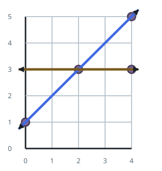
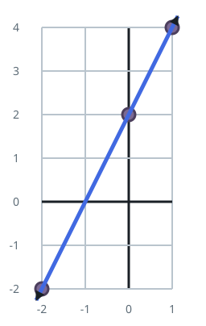

# Fewest Lines Through All the Points

## Description

You are given a list of points `points`, where `points[i] = [x_i, y_i]` is a
point on the X-Y plane.

You may draw any number of straight lines on the plane. A point is covered
when it lies on at least one of the drawn lines.

Return the fewest straight lines that can cover every point.

### Example 1



```text
Input: points = [[0,1],[2,3],[4,5],[4,3]]
Output: 2
Explanation: Two lines are both necessary and sufficient:
- The diagonal through (0, 1), (2, 3), and (4, 5) covers those three points
at once.
- A horizontal line through (4, 3) covers the remaining point.
No single line passes through all four points, so one line cannot do it.
```

### Example 2



```text
Input: points = [[0,2],[-2,-2],[1,4]]
Output: 1
Explanation: All three points are collinear, so a single line through
(-2, -2) and (1, 4) covers everything.
```

### Constraints

- `1 <= points.length <= 10`
- `points[i].length == 2`
- `-100 <= x_i, y_i <= 100`
- Every point is distinct.

## Hints

### Hint 1

How large can the answer ever be for `n` points?

### Hint 2

At most `ceil(n / 2)`: a line can always be blamed on two of the points, and
an odd leftover point takes one line of its own.

### Hint 3

If a line is already known to cover two points, what is the cheapest test
for whether some third point lies on it too?

### Hint 4

Compare direction vectors rather than slopes: the third point lies on the
line exactly when the cross product of `(second - first)` and
`(third - first)` is zero — and that test uses only integer arithmetic.
