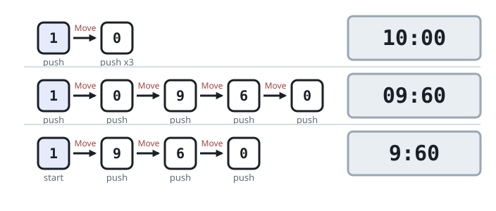
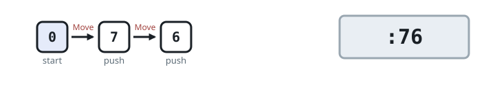

# Cheapest Way to Enter a Cooking Time

## Description

A microwave is programmed by typing at most four digits. Whatever you type
is padded on the left with zeroes out to four digits; the first two are read
as the minutes, the last two as the seconds, and the two fields are added to
obtain the cooking time. Times from one second up to 99 minutes and 99
seconds can be expressed this way. For instance, typing `954` pads to `0954`
and means 9 minutes 54 seconds, while `0008` means 0 minutes and 8 seconds —
an over-long seconds field such as `8090` is still read literally, as
80 minutes 90 seconds.

You are given four integers: `startAt`, the digit your finger currently
rests on; `moveCost`, the fatigue of sliding the finger from its digit to an
adjacent press on a different digit; `pushCost`, the fatigue of pressing the
digit under the finger once; and `targetSeconds`, the cooking time you want.

Many different digit sequences can realize the same `targetSeconds`. Return
the smallest total fatigue — one `moveCost` per slide plus one `pushCost`
per press — over every sequence the microwave reads as exactly
`targetSeconds` seconds. Remember that a minute is 60 seconds.

### Example 1



```text
Input: startAt = 1, moveCost = 2, pushCost = 1, targetSeconds = 600
Output: 6
Explanation: Three spellings reach 600 seconds: `1 0 0 0` (10 minutes
even), `0 9 6 0` (9 minutes 60 seconds), and `9 6 0`, which pads to the same
`0 9 6 0`. Typing `1 0 0 0` wins — the finger already rests on `1`, so the
single press plus one slide and three presses of `0` costs
1 + 2 + 1 + 1 + 1 = 6, while the two `09:60` spellings start with the finger
off their first digit and come out to 12 and 9.
```

### Example 2



```text
Input: startAt = 0, moveCost = 1, pushCost = 2, targetSeconds = 76
Output: 6
Explanation: The cheapest spelling is the two-keystroke `7 6` — 76 seconds.
Sliding from `0` to `7` costs 1 and each press costs 2, so
1 + 2 + 1 + 2 = 6. The longer alternatives `0 0 7 6`, `0 7 6`, `0 1 1 6`,
and `1 1 6` (1 minute 16 seconds) all cost more.
```

### Example 3

```text
Input: startAt = 1, moveCost = 5, pushCost = 1, targetSeconds = 671
Output: 4
Explanation: 671 seconds has exactly two spellings: `1 0 7 1` (10 minutes
71 seconds) and `1 1 1 1` (11 minutes 11 seconds). Typing `1 1 1 1` keeps
the finger parked on `1` and presses four times for a cost of 4, while
`1 0 7 1` would add three slides at 5 apiece for a total of 19.
```

### Constraints

- `0 <= startAt <= 9`
- `1 <= moveCost, pushCost <= 10⁵`
- `1 <= targetSeconds <= 6039`

## Hints

### Hint 1

Every possible spelling is a pair (minutes, seconds) whose fields both lie
in `[0, 99]` and which together add up to `targetSeconds`.

### Hint 2

Fix the minute count anywhere in `[0, 99]`; the seconds field is then forced
to `targetSeconds - 60 * minutes`, and the spelling survives only if that
value also lands in `[0, 99]`.

### Hint 3

To price a surviving pair, strip the leading zeroes from its four digits and
walk what remains: each digit that differs from where the finger rests adds
`moveCost` and relocates it, and every digit adds `pushCost`.

### Hint 4

At most a hundred pairs can survive, so pricing them all and keeping the
cheapest settles the problem.
