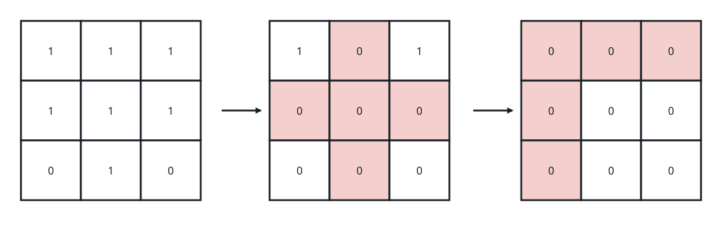
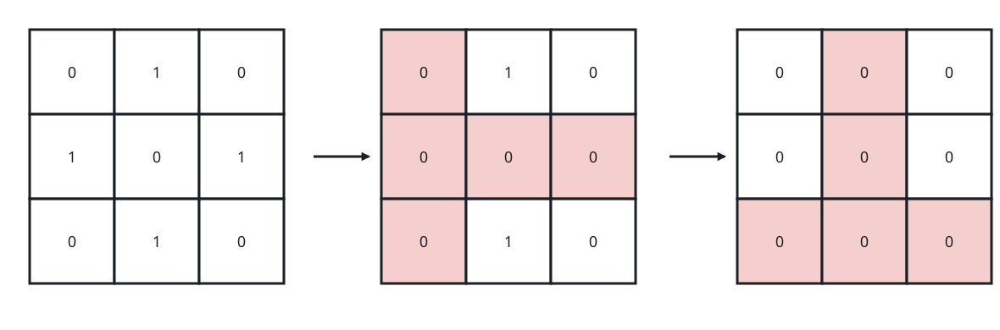
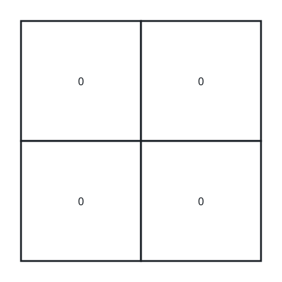

# Fewest Cross-Outs to Clear the Grid II

## Description

You are handed a 0-indexed binary matrix `grid` with `m` rows and `n`
columns. A single cross-out chooses a cell that currently holds a 1 and,
in one stroke, writes 0 into every cell of that cell's row and every
cell of its column.

A cross-out must be aimed at a 1; it can never target a cell holding 0.
Return the fewest cross-outs after which the grid contains nothing but
zeros.

### Example 1



```text
Input: grid = [[1,1,1],[1,1,1],[0,1,0]]
Output: 2
Explanation:
Aim the first cross-out at the center cell: row 1 and column 1 go to
zero together. Aim the second at the top-left cell, clearing row 0 and
column 0. Two strokes leave no 1 standing.
```

### Example 2



```text
Input: grid = [[0,1,0],[1,0,1],[0,1,0]]
Output: 2
Explanation:
The first cross-out takes the 1 in row 1, column 0, wiping that row and
column; the second takes the 1 in row 2, column 1. Note the center cell
holds 0, so it is never a legal target.
```

### Example 3



```text
Input: grid = [[0,0],[0,0]]
Output: 0
Explanation:
Nothing needs clearing, so the count is zero.
```

### Constraints

- `m` and `n` are the numbers of rows and columns of `grid`
- `1 <= m, n <= 15`
- `1 <= m * n <= 15`
- Every entry of `grid` is `0` or `1`.

## Hints

### Hint 1

The whole board holds at most 15 cells, so a state space searched by
hand-sized steps is still tiny.

### Hint 2

Recursively decide which surviving 1-cell gets crossed out next; the
stroke it triggers also removes whatever other ones share its row or
column.

### Hint 3

Key a memo table on the bitmask of cells that still hold 1 so identical
boards are solved once.
