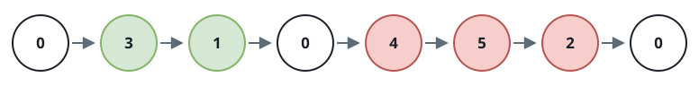
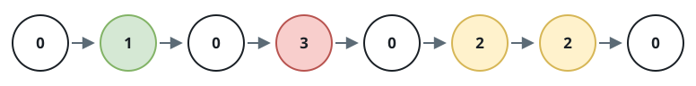

# Fuse Zero-Separated Segments

## Description

A linked list is handed to you as an alternating pattern: a run of
non-zero values, then a `0`, then another run, then a `0`, and so on.
Both the very first and the very last node hold `0`, and no two `0`s are
ever adjacent.

Collapse each run of non-zero nodes that sits between a pair of
consecutive `0`s into one node holding the run's total, drop every `0`
from the result, and return the head of the rebuilt list.

### Example 1



```text
Input: head = [0,3,1,0,4,5,2,0]
Output: [4,11]
Explanation:
Each interior run becomes one summed node — `3 + 1 = 4` in the first
run, `4 + 5 + 2 = 11` in the second.
```

### Example 2



```text
Input: head = [0,1,0,3,0,2,2,0]
Output: [1,3,4]
Explanation:
The three runs total `1`, `3`, and `2 + 2 = 4` respectively, giving a
three-node answer.
```

### Example 3

```text
Input: head = [0,9,2,8,0]
Output: [19]
Explanation:
A single run between the boundary zeros collapses into one node
carrying `9 + 2 + 8 = 19`.
```

### Constraints

- The list contains between `3` and `2 * 10^5` nodes.
- Every node value is between `0` and `1000`.
- Two `0`-valued nodes are never adjacent.
- Both the first and the last node hold `0`.
