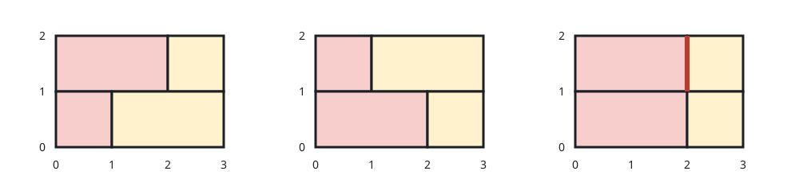

# Count Sturdy Brick Wall Layouts

## Description

Two integers `height` and `width` give the dimensions of a brick wall
you want to lay out. You also receive a 0-indexed array `bricks` of
distinct integers: a brick of type `bricks[i]` is one unit tall and
`bricks[i]` units wide, you own infinitely many of every type, and
bricks cannot be turned sideways.

Every row of the wall must span exactly `width` units. The wall counts
as sturdy when neighboring rows never have two bricks meeting at the
same horizontal position — the wall's two ends don't count as a meeting
point.

How many distinct sturdy walls can be built? The answer can be huge, so
report it modulo `10^9 + 7`.

### Example 1



```text
Input: height = 2, width = 3, bricks = [1,2]
Output: 2
Explanation:
Exactly two sturdy layouts exist for a 2x3 wall: a `[1,2]` row over a
`[2,1]` row, or the reverse order. Placing `[1,2]` directly over another
`[1,2]` fails because both rows have bricks meeting 1 unit from the
left edge.
```

### Example 2

```text
Input: height = 1, width = 5, bricks = [1,2,3]
Output: 13
Explanation:
With a single row, sturdiness is automatic, so the answer is just the
number of ways to tile a length of 5 using pieces of sizes 1, 2, and 3
— thirteen of them.
```

### Example 3

```text
Input: height = 3, width = 4, bricks = [1,2]
Output: 2
Explanation:
Five different single rows exist, but only two stack three high:
`[1,2,1] / [2,2] / [1,2,1]` and the reversed stacking
`[2,2] / [1,2,1] / [2,2]`.
```

### Constraints

- `1 <= height <= 100`
- `1 <= width <= 10`
- `1 <= bricks.length <= 10`
- `1 <= bricks[i] <= 10`
- All values in `bricks` are distinct.

## Hints

### Hint 1

Encode a row by the set of horizontal positions where two of its bricks
meet — that set pins the row down completely.

### Hint 2

Given one row, the rows that may sit directly beneath it are exactly the
ones whose meeting positions avoid the row's own meeting positions.

### Hint 3

Run a dynamic program over the rows: keep one count per distinct row
mask and extend the wall one layer at a time, moving counts only across
disjoint mask pairs.
