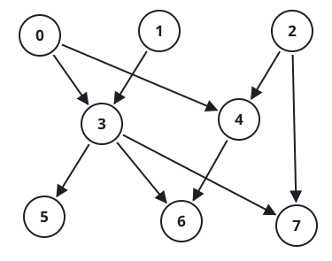
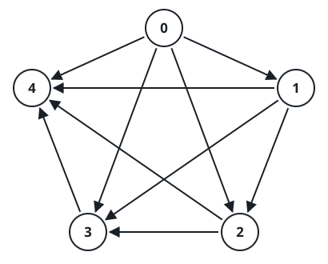

# Upstream Nodes in a DAG

## Description

You are given a positive integer `n`, the number of nodes in a directed
acyclic graph, numbered `0` through `n - 1`.

You are also given a 2D integer array `edges`, where `edges[i] =
[fromi, toi]` means a one-way edge runs from `fromi` to `toi`.

Build a list `answer` in which `answer[i]` holds every node that can
reach node `i` by following edges, in ascending order.

Node `u` can reach node `v` when there is some way to travel from `u`
to `v` along the graph's edges.

### Example 1



```text
Input: n = 8, edges = [[0,3],[0,4],[1,3],[2,4],[2,7],[3,5],[3,6],
[3,7],[4,6]]
Output: [[],[],[],[0,1],[0,2],[0,1,3],[0,1,2,3,4],[0,1,2,3]]
Explanation:
- Nodes 0, 1, and 2 sit at the top: nothing reaches them.
- Both 0 and 1 can reach node 3, and both 0 and 2 can reach node 4.
- Node 5 is reachable from 0, 1, and 3.
- Node 6 is reachable from 0, 1, 2, 3, and 4.
- Node 7 is reachable from 0, 1, 2, and 3.
```

### Example 2



```text
Input: n = 5, edges = [[0,1],[0,2],[0,3],[0,4],[1,2],[1,3],[1,4],
[2,3],[2,4],[3,4]]
Output: [[],[0],[0,1],[0,1,2],[0,1,2,3]]
Explanation:
- Nothing reaches node 0.
- Node 1 is reachable only from 0.
- Node 2 is reachable from 0 and 1.
- Node 3 is reachable from 0, 1, and 2.
- Node 4 is reachable from 0, 1, 2, and 3.
```

### Constraints

- `1 <= n <= 1000`
- `0 <= edges.length <= min(2000, n * (n - 1) / 2)`
- `edges[i].length == 2`
- `0 <= fromi, toi <= n - 1`
- `fromi != toi`
- There are no duplicate edges.
- The graph is directed and acyclic.

## Hints

### Hint 1

Try flipping the direction of every edge — what does reachability mean
in the reversed graph?

### Hint 2

In the reversed graph, a single traversal out of node `i` visits
exactly the nodes that reach `i` in the original.
