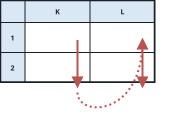
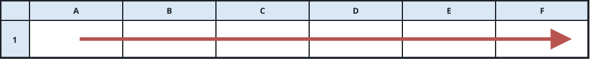

# Cells of a Spreadsheet Rectangle

## Description

On a spreadsheet, a cell is written as the string `"<col><row>"`:

- `<col>` names the cell's column with capital letters — column `A`
  comes first, then `B`, then `C`, and so on through `Z`.
- `<row>` is the cell's row number, written as a positive integer.

You are given a string `s` shaped like `"<col1><row1>:<col2><row2>"`,
where `col1` with `row1` pinpoints one corner of a rectangle of cells
and `col2` with `row2` the opposite corner. The corners satisfy
`r1 <= r2` and `c1 <= c2`.

List every cell `(x, y)` with `r1 <= x <= r2` and `c1 <= y <= c2`,
writing each one in the same `"<col><row>"` form. The list must run
column by column, and within a column row by row.

### Example 1



```text
Input: s = "K1:L2"
Output: ["K1","K2","L1","L2"]
Explanation: The rectangle from K1 down to L2 holds four cells; they
are listed column first (K before L), rows ascending inside each
column.
```

### Example 2



```text
Input: s = "A1:F1"
Output: ["A1","B1","C1","D1","E1","F1"]
Explanation: The rectangle is a single row of six cells stretching from
column A to column F.
```

### Constraints

- `s.length == 5`
- `'A' <= s[0] <= s[3] <= 'Z'`
- `'1' <= s[1] <= s[4] <= '9'`
- `s` consists of uppercase English letters, digits and ':'.

## Hints

### Hint 1

The five characters of `s` hand you both corners directly — pull the
two column letters and the two row digits apart.

### Hint 2

Loop the column letter from the first to the second, and inside that
loop the row from bottom to top; emitting as you go already yields the
sorted order.
