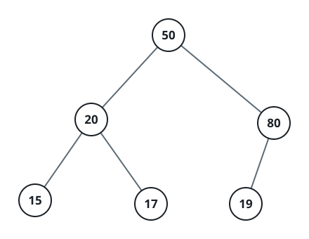
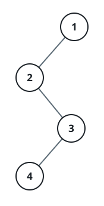

# Assemble A Binary Tree From Edge Notes

## Description

A binary tree of distinct node values is described to you only through
its edges. You receive a 2D integer array `descriptions` where
`descriptions[i] = [parenti, childi, isLefti]` records one edge of the
tree: `parenti` is the parent of `childi`, and `isLefti` says which side
the child hangs on — `1` for the left, `0` for the right.

Put the tree together from these notes and return its root.

The described tree is guaranteed to be valid.

### Example 1



```text
Input: descriptions = [[20,15,1],[20,17,0],[50,20,1],[50,80,0],[80,19,1]]
Output: [50,20,80,15,17,19]
Explanation: 50 is the root — no edge names it as a child. It carries 20
on the left and 80 on the right; 20 in turn holds 15 on the left and 17
on the right, and 80 holds 19 on the left.
```

### Example 2



```text
Input: descriptions = [[1,2,1],[2,3,0],[3,4,1]]
Output: [1,2,null,null,3,4]
Explanation: 1 is the only value never listed as a child, and the notes
chain downward from it: 2 as a left child of 1, then 3 as 2's right
child, then 4 as 3's left child.
```

### Example 3

```text
Input: descriptions = [[9,4,0],[9,6,1],[14,9,0],[14,3,1]]
Output: [14,3,9,null,null,6,4]
Explanation: 14 sits at the root, with 3 as its left child and 9 as its
right child; 9 then holds 6 on the left and 4 on the right.
```

### Constraints

- `1 <= descriptions.length <= 10⁴`
- `descriptions[i].length == 3`
- `1 <= parenti, childi <= 10⁵`
- `0 <= isLefti <= 1`
- The tree the descriptions describe is valid.

## Hints

### Hint 1

A map from node value to its already-created node lets you create-or-
fetch in constant time as each edge arrives, without knowing the tree's
shape in advance.

### Hint 2

Every node except the root gets attached to some parent somewhere in the
notes — so keep track of which values have appeared on the child side.

### Hint 3

Once all the edges are wired, exactly one created value never showed up
as anybody's child. That value is the root.
