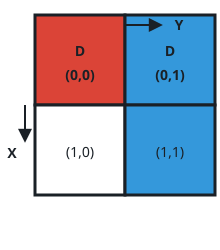

# Fully Excavated Relics

## Description

An excavation site is laid out as an `n x n` grid of cells, and several
relics lie buried under it. Each relic occupies a rectangular patch of
cells: `relics[i] = [r1, c1, r2, c2]` says that the `i`th relic covers
every cell from `(r1, c1)`, its top-left corner, through `(r2, c2)`, its
bottom-right corner.

A crew then works through a list of digs, clearing one cell per entry:
`digs[j] = [r, c]` means the cell in row `r`, column `c` gets excavated.
Clearing a cell uncovers whatever lies directly beneath it, and a relic
becomes recoverable exactly when every cell it covers has been cleared.

Return how many relics are fully recoverable once the whole dig list has
been processed.

The input satisfies:

- no two relics share a cell;
- each relic covers at most 4 cells;
- all dig positions are distinct.

### Example 1



```text
Input: n = 2, relics = [[0,0,0,0],[0,1,1,1]], digs = [[0,0],[0,1]]
Output: 1
Explanation:
The colors distinguish the two relics, and cleared cells are marked with
a 'D'. The first relic has its only cell cleared, so it comes out whole.
The second relic still has cell (1,1) buried, so it stays in the ground.
```

### Example 2


```text
Input: n = 2, relics = [[0,0,0,0],[0,1,1,1]], digs = [[0,0],[0,1],[1,1]]
Output: 2
Explanation: This time the extra dig clears (1,1) as well, so both relics
have every cell uncovered and the answer is 2.
```

### Example 3

```text
Input: n = 3, relics = [[0,0,0,1],[1,1,1,1],[2,0,2,0]], digs = [[0,0],[0,1],[1,1],[2,1]]
Output: 2
Explanation: The first relic is cleared by the digs at (0,0) and (0,1),
and the second by the dig at (1,1). The third relic sits at (2,0), a cell
the crew never touched — they dug (2,1) instead — so only 2 relics are
recoverable.
```

### Constraints

- `1 <= n <= 1000`
- `1 <= relics.length, digs.length <= min(n², 10⁵)`
- `relics[i].length == 4`
- `digs[j].length == 2`
- `0 <= r1, c1, r2, c2, r, c <= n - 1`
- `r1 <= r2` and `c1 <= c2` for every relic
- No two relics overlap.
- Each relic covers at most 4 cells.
- All dig positions are distinct.

## Hints

### Hint 1

The core question is membership: after reading the dig list, you must be
able to ask "has cell `(r, c)` been cleared?" instantly, since rescanning
all digs for every relic cell is far too slow at these limits.

### Hint 2

Record each cleared cell in a boolean grid as you read the digs. Then a
relic is recoverable precisely when a walk over its rectangle finds no
uncleared flag — and each rectangle holds at most 4 cells.
