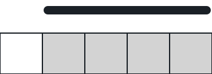

# Fewest Tiles Left in the Open

## Description

A floor is tiled in a single row and described by a 0-indexed binary
string `floor`:

- `floor[i] = '0'` means the `i`th tile is dark.
- `floor[i] = '1'` means the `i`th tile is bright.

You also receive `numCarpets` and `carpetLen`: you hold `numCarpets` dark
rugs, each one stretching over exactly `carpetLen` consecutive tiles.
Lay the rugs out so that as few bright tiles as possible stay exposed.
Rugs may overlap each other freely.

Return the smallest number of bright tiles that can remain in the open.

### Example 1


```text
Input: floor = "10110101", numCarpets = 2, carpetLen = 2
Output: 2
Explanation: The figure shows one placement of the two rugs that leaves
just 2 bright tiles exposed, and no arrangement can do better than 2.
```

### Example 2



```text
Input: floor = "11111", numCarpets = 2, carpetLen = 3
Output: 0
Explanation: The figure shows how two overlapping rugs of length 3 can
blanket all five bright tiles, leaving none exposed.
```

### Example 3

```text
Input: floor = "1001001", numCarpets = 1, carpetLen = 3
Output: 2
Explanation: The three bright tiles sit three positions apart, so a
single 3-tile rug covers only one of them wherever it lands; two bright
tiles always stay in the open.
```

### Constraints

- `1 <= carpetLen <= floor.length <= 1000`
- `floor[i]` is either `'0'` or `'1'`.
- `1 <= numCarpets <= 1000`

## Hints

### Hint 1

Dynamic programming fits: a tile's fate depends only on the suffix still
ahead and the rugs left to spend.

### Hint 2

Let `dp[i][j]` be the fewest bright tiles exposed across positions
`i .. end` when at most `j` rugs are still available.

### Hint 3

Each state chooses between leaving tile `i` exposed and starting a rug
with its left edge on tile `i`, which covers the next `carpetLen` tiles
at once.
