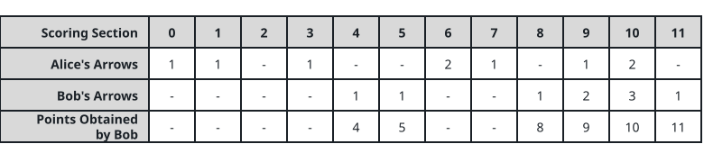
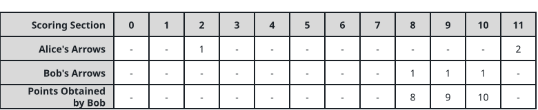

# Winning the Archery Duel

## Description

Alice and Bob face off in an archery duel that follows strict rules:

- Alice looses `numArrows` arrows first, then Bob looses the same
  `numArrows` arrows.
- Scoring works like this:
    - The target is divided into scoring rings numbered `0` through `11`.
    - Take any ring worth `k` points, and let `ak` and `bk` be the number
      of arrows Alice and Bob landed there. Alice claims the ring's `k`
      points when `ak >= bk`, and Bob claims them when `ak < bk`.
    - When `ak == bk == 0` the ring is untouched and scores for neither.

For instance, if Alice and Bob each land 2 arrows in the ring worth 11,
Alice pockets those 11 points; if Alice lands none there and Bob lands 2,
the 11 points are his.

You know `numArrows` and the array `aliceArrows` of length 12, counting
Alice's arrows in rings `0` through `11`. Bob plays to beat her, collecting
as many points as he can.

Return the array `bobArrows` of length 12 giving Bob's arrows per ring,
whose entries must sum to exactly `numArrows`.

Many allocations can tie for the best total; the judge accepts one
specific answer: take `aliceArrows[k] + 1` arrows in every ring `k` you
decide to win, dump everything left over into ring `0`, and when several
ring sets score equally, prefer the set whose bitmask `Σ 2ᵏ` is smallest.

### Example 1



```text
Input: numArrows = 9, aliceArrows = [1,1,0,1,0,0,2,1,0,1,2,0]
Output: [0,0,0,0,1,1,0,0,1,2,3,1]
Explanation: Bob's rings are worth 4 + 5 + 8 + 9 + 10 + 11, a total of
47 points, and no allocation of his 9 arrows can do better.
```

### Example 2



```text
Input: numArrows = 3, aliceArrows = [0,0,1,0,0,0,0,0,0,0,0,2]
Output: [0,0,0,0,0,0,0,0,1,1,1,0]
Explanation: Bob's rings are worth 8 + 9 + 10, a total of 27 points,
which is the best his 3 arrows can achieve.
```

### Constraints

- `1 <= numArrows <= 10⁵`
- `aliceArrows.length == bobArrows.length == 12`
- `0 <= aliceArrows[i], bobArrows[i] <= numArrows`
- `sum(aliceArrows[i]) == numArrows`

## Hints

### Hint 1

Claiming ring `x` for yourself — what is the cheapest arrow count that
achieves it?

### Hint 2

Only twelve rings exist. Could you enumerate every possible set of rings
Bob goes for?

### Hint 3

For each candidate set of rings, total the arrows it needs; if Bob's quota
covers the bill, that set is a legal pick.
