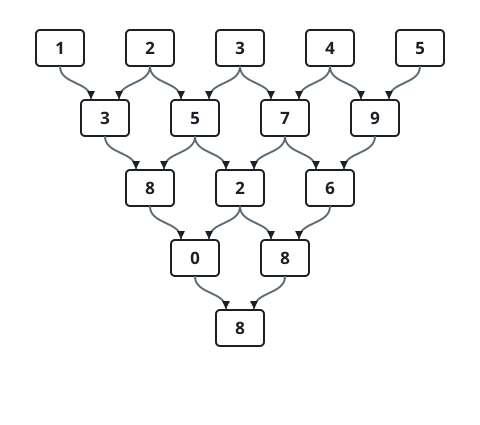

# Repeated Adjacent-Sum Cascade

## Description

You are given a 0-indexed integer array `nums` whose entries are all
digits — each is between 0 and 9.

The array is reduced by a cascade of rounds. In each round, every
consecutive pair of neighbors collapses into their digit sum: position `i`
of the next row holds `(nums[i] + nums[i + 1]) mod 10`. Each round leaves
one fewer entry than the row before it, and the cascade stops when exactly
one digit remains.

Return that final digit.

### Example 1



```text
Input: nums = [1,2,3,4,5]
Output: 8
Explanation:
The diagram traces the cascade row by row: each row shows the pairwise
digit sums of the row above it, and the single digit left at the bottom
is 8.
```

### Example 2

```text
Input: nums = [4,2,6,1]
Output: 9
Explanation:
The rows are `4 2 6 1`, then `6 8 7`, then `4 5`, and finally `9`.
```

### Example 3

```text
Input: nums = [9,8]
Output: 7
Explanation:
The only pair collapses to `(9 + 8) mod 10 = 7`.
```

### Example 4

```text
Input: nums = [3,3,3,3,3,3]
Output: 6
Explanation:
The rows shrink as `3 3 3 3 3 3` → `6 6 6 6 6` → `2 2 2 2` → `4 4 4` →
`8 8` → `6`.
```

### Constraints

- `1 <= nums.length <= 1000`
- `0 <= nums[i] <= 9`

## Hints

### Hint 1

With at most 1000 entries, replaying the rounds directly is affordable.
Focus on how one pass turns the current row into the next one.

### Hint 2

No fresh array is needed per round: walk one array left to right, writing
`nums[i] = (nums[i] + nums[i + 1]) mod 10`. Each write lands before the
cell to its right is read, so the old values survive exactly as long as
they are needed.
