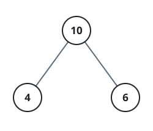
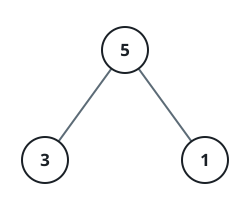

# The Root Carries the Child Sum

## Description

Here a binary tree stops after one level: a root with a left child and a
right child, and nothing deeper. Each of the three nodes holds an integer,
and the question is whether the root's own value happens to equal the total
of the two values beneath it.

Return true exactly when the root's value equals its children's combined
value, and false otherwise.

### Example 1



```text
Input: root = [10,4,6]
Output: true
Explanation: The children hold 4 and 6, which total 10 — precisely the
root's own value.
```

### Example 2



```text
Input: root = [5,3,1]
Output: false
Explanation: The children hold 3 and 1, totaling 4, while the root holds 5 —
not a match.
```

### Constraints

- The tree holds exactly three nodes: the root and its two children.
- `-100 <= Node.val <= 100`
