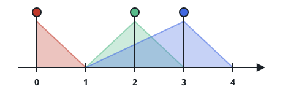

# Bright Enough Street Spots

## Description

Picture a street as a number line of spots numbered `0` through `n - 1`.
Lamps are hung along it: lamp `i` sits at `position_i` with reach `range_i`,
washing every spot from `max(0, position_i - range_i)` through
`min(n - 1, position_i + range_i)`, endpoints included.

A spot's brightness is how many lamps wash it. Every spot also carries a bar
to clear: `requirement[i]` is the smallest brightness spot `i` may run at.

Count the spots whose brightness meets or exceeds their own bar.

### Example 1



```text
Input: n = 5, lights = [[0,1],[2,1],[3,2]], requirement = [0,2,1,4,1]
Output: 4
Explanation: The three lamps wash [0,1], [1,3], and [1,4], so the spot
brightnesses read 1, 3, 2, 2, 1. Against the bars 0, 2, 1, 4, 1, every spot
but spot 3 (2 against a bar of 4) makes it — including spot 4, whose
brightness of 1 exactly meets its bar.
```

### Example 2

```text
Input: n = 4, lights = [[1,1],[2,0]], requirement = [1,2,3,1]
Output: 1
Explanation: The lamps wash [0,2] and [2,2], giving brightnesses
1, 1, 2, 0. Only spot 0 clears its bar; the rest fall short of 2, 3, and 1.
```

### Example 3

```text
Input: n = 7, lights = [[0,2],[6,3]], requirement = [1,1,1,2,1,1,0]
Output: 6
Explanation: One lamp covers spots 0-2 and the other covers spots 3-6, so
every spot sees exactly one lamp. Spot 3 wants 2 but gets 1; the other six
spots clear their bars.
```

### Example 4

```text
Input: n = 3, lights = [[2,5]], requirement = [0,0,2]
Output: 2
Explanation: The single lamp floods the whole street with brightness 1.
Spots 0 and 1 demand nothing and pass; spot 2 demands 2 and fails.
```

### Constraints

- `1 <= n <= 10⁵`
- `1 <= lights.length <= 10⁵`
- `0 <= position_i < n`
- `0 <= range_i <= 10⁵`
- `requirement.length == n`
- `0 <= requirement[i] <= 10⁵`

### Hint 1

Painting each lamp's whole range spot by spot is too slow once both the
street and the lamp list get long. Can a lamp be recorded in a single step
instead?

### Hint 2

Write `+1` where a lamp's wash begins and `-1` just past where it ends, then
sweep the street once while carrying a running brightness.
