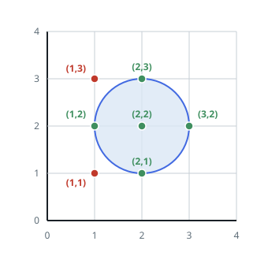
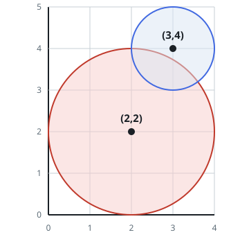

# Grid Points the Circles Cover

## Description

You are given a 2D integer array `circles`, where `circles[i] = [xi, yi, ri]`
describes a circle drawn on a grid: its center sits at `(xi, yi)` and its
radius is `ri`. Count the grid points that are covered by at least one of the
circles.

### Note

- A grid point is a point whose two coordinates are both integers.
- A point lying exactly on a circle's boundary counts as covered by that circle.

### Example 1



```text
Input: circles = [[2,2,1]]
Output: 5
Explanation:
The diagram shows the single circle.
Five grid points lie inside it — (1, 2), (2, 1), (2, 2), (2, 3), and
(3, 2) — drawn in green.
Nearby points such as (1, 1) and (1, 3), drawn in red, fall outside it.
```

### Example 2



```text
Input: circles = [[2,2,2],[3,4,1]]
Output: 16
Explanation:
The diagram shows both circles.
Exactly 16 grid points are covered by at least one of them; for instance
(0, 2), (2, 0), (2, 4), (3, 2), and (4, 4).
```

### Example 3

```text
Input: circles = [[4,3,2]]
Output: 13
Explanation:
The circle centered at (4, 3) with radius 2 reaches 13 grid points.
```

### Constraints

- `1 <= circles.length <= 200`
- `circles[i].length == 3`
- `1 <= xi, yi <= 100`
- `1 <= ri <= min(xi, yi)`

## Hints

### Hint 1

For a single circle, how would you decide whether a given grid point lies
inside it?

### Hint 2

There is no need to scan the whole plane: a circle can only reach points
whose coordinates stay within `x ± r` and `y ± r`, so test just that
bounding square. Collect the points you cover in a set so circles that
overlap are not counted twice.
