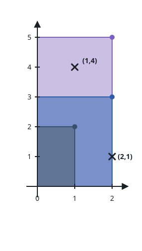
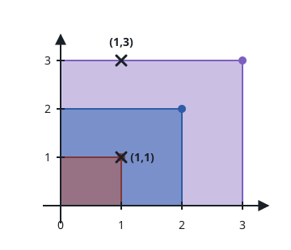

# How Many Boxes Hold Each Point

## Description

You are given a 2D integer array `rectangles`, where
`rectangles[i] = [l_i, h_i]` describes a box with length `l_i` and height
`h_i`. You are also given a 2D integer array `points`, where
`points[j] = [x_j, y_j]` gives the coordinates of a point.

Every box is anchored to the axes: its bottom-left corner sits at `(0, 0)`
and its top-right corner sits at `(l_i, h_i)`.

Return an integer array `count` of length `points.length`, where `count[j]`
is how many boxes hold the `j-th` point. A box holds a point when
`0 <= x_j <= l_i` and `0 <= y_j <= h_i`; a point lying on a box's edge
counts as held.

### Example 1



```text
Input: rectangles = [[1,2],[2,3],[2,5]], points = [[2,1],[1,4]]
Output: [2,1]
Explanation:
The first box holds neither point.
The second box holds only (2, 1).
The third box holds both (2, 1) and (1, 4).
So (2, 1) is held by 2 boxes and (1, 4) by 1, giving [2, 1].
```

### Example 2



```text
Input: rectangles = [[1,1],[2,2],[3,3]], points = [[1,3],[1,1]]
Output: [1,3]
Explanation:
Only the third box reaches (1, 3), while all three boxes hold (1, 1),
so the answer is [1, 3].
```

### Example 3

```text
Input: rectangles = [[9,4],[3,2],[6,6]], points = [[4,3],[10,1],[2,7]]
Output: [2,0,0]
Explanation:
The point (4, 3) fits inside the boxes [9,4] and [6,6].
No box is long enough to reach (10, 1), and none is tall enough to
reach (2, 7).
```

### Constraints

- `1 <= rectangles.length, points.length <= 5 * 10⁴`
- `rectangles[i].length == points[j].length == 2`
- `1 <= l_i, x_j <= 10⁹`
- `1 <= h_i, y_j <= 100`
- All the boxes are pairwise distinct.
- All the points are pairwise distinct.

## Hints

### Hint 1

Heights never exceed 100, so a point can be answered by walking only the
heights from its `y` upward instead of scanning every box.

### Hint 2

Fix a height: every box of that height holds the point exactly when its
length is at least the point's `x`. How could you count such boxes quickly?

### Hint 3

Sort the lengths within each height bucket and answer each height with a
binary search.
