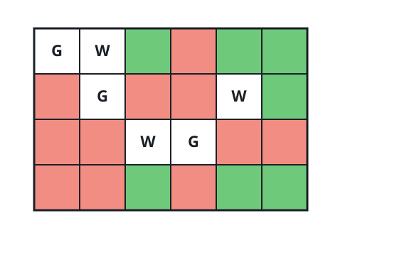
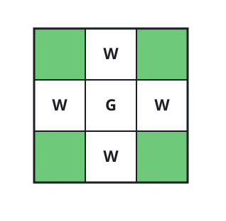

# Blind Spots on the Grid

## Description

You are given two integers `m` and `n` describing a 0-indexed `m x n` grid.
You are also given two 2D integer arrays `guards` and `walls`, where
`guards[i] = [row_i, col_i]` is the cell of the `i-th` guard and
`walls[j] = [row_j, col_j]` is the cell of the `j-th` wall.

Standing on its cell, a guard watches along its row and its column in all
four directions, until a wall or another guard blocks the view. A cell is
watched when some guard can see it.

A **blind spot** is an unoccupied cell that no guard watches. Return how
many blind spots the grid contains.

### Example 1



```text
Input: m = 4, n = 6, guards = [[0,0],[1,1],[2,3]], walls = [[0,1],[2,2],[1,4]]
Output: 7
Explanation:
In the diagram the watched cells are red and the blind spots are green.
Seven cells are seen by no guard, so the answer is 7.
```

### Example 2



```text
Input: m = 3, n = 3, guards = [[1,1]], walls = [[0,1],[1,0],[2,1],[1,2]]
Output: 4
Explanation:
The ring of walls pins the lone guard to the center cell, leaving the four
corners — shown green in the diagram — as blind spots.
```

### Example 3

```text
Input: m = 2, n = 3, guards = [[0,0]], walls = [[1,2]]
Output: 1
Explanation:
The guard sees (0,1), (0,2), and (1,0); the wall occupies (1,2).
Only (1,1) is left unoccupied and unwatched.
```

### Constraints

- `1 <= m, n <= 10⁵`
- `2 <= m * n <= 10⁵`
- `1 <= guards.length, walls.length <= 5 * 10⁴`
- `2 <= guards.length + walls.length <= m * n`
- `guards[i].length == walls[j].length == 2`
- `0 <= row_i, row_j < m`
- `0 <= col_i, col_j < n`
- All the positions in `guards` and `walls` are distinct.

## Hints

### Hint 1

Lay out a 2D board of cell states. How would you record every cell a
guard can see?

### Hint 2

Walk outward from each guard one cell at a time in each of the four
directions, marking cells as you go. What should make the walk stop?
