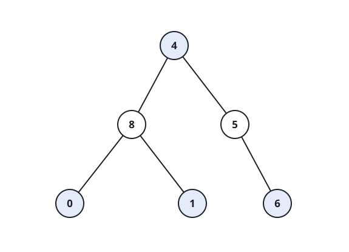

# Nodes Matching Their Subtree Average

## Description

A binary tree is given by its `root`. Count the nodes whose own value equals
the average of all the values in their subtree, and return that count.

Notes:

- The average of `n` values means their sum divided by `n`, rounded down to
  the nearest integer.
- A node's subtree is the node itself together with every one of its
  descendants.

### Example 1



```
Input: root = [4,8,5,0,1,null,6]
Output: 5
Explanation: Five of the six nodes qualify. The root 4 matches its
subtree average (4+8+5+0+1+6)/6 = 4; the node 5 matches (5+6)/2 = 5; and
the leaves 0, 1, and 6 each equal their own single-node average. Only the
node 8, whose subtree averages 3, falls short.
```

### Example 2


```
Input: root = [1]
Output: 1
Explanation: A lone node's subtree holds just its own value, so the
average is 1 and the node matches.
```

### Constraints

- The tree contains between 1 and 1000 nodes.
- Every node value lies in the range `[0, 1000]`.

## Hints

### Hint 1

Checking one node needs only two numbers: the total of its subtree's values
and how many nodes that subtree holds.

### Hint 2

Fold that pair up the tree in one traversal — a node combines the
(sum, size) pairs reported by its children, adds its own contribution, and
tests the floor of the quotient against its value before passing the pair on.
