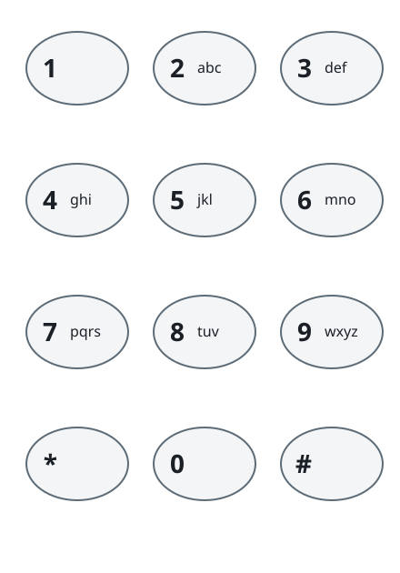

# Messages Hidden in the Key Presses

## Description

Typing on an old phone keypad works by tapping a digit key repeatedly until
the wanted letter appears. The digits map to letters in the usual layout,
each digit offering its letters in order:

- `2` offers `a`, `b`, `c`; `3` offers `d`, `e`, `f`
- `4` offers `g`, `h`, `i`; `5` offers `j`, `k`, `l`
- `6` offers `m`, `n`, `o`; `7` offers `p`, `q`, `r`, `s`
- `8` offers `t`, `u`, `v`; `9` offers `w`, `x`, `y`, `z`



Producing the `i-th` letter of a key's group takes `i` taps of that key. To
type `'s'`, the sender taps `'7'` four times; to type `'k'`, they tap `'5'`
twice. The digits `'0'` and `'1'` carry no letters and never appear.

A receiver that missed the actual text saw only the string of tapped keys.
For instance, the message `"bob"` reaches the receiver as `"2266622"`.

Given the received string `pressedKeys`, count how many distinct messages
could have produced it. The count can be enormous, so report it modulo
`10⁹ + 7`.

### Example 1

```
Input: pressedKeys = "2222"
Output: 7
Explanation: The seven candidate messages are "aaaa", "aab", "aba",
"baa", "bb", "ad", and "da" — every way of splitting four taps of the
same key into letters of one to three taps each.
```

### Example 2

```
Input: pressedKeys = "77"
Output: 2
Explanation: Key `7` offers four letters, so two taps spell either "pp"
(two `p`s) or "q" (one `q`).
```

### Example 3

```
Input: pressedKeys = "999"
Output: 4
Explanation: The taps split as "www", "wx", "xw", or "y", giving four
possible messages.
```

### Constraints

- `1 <= pressedKeys.length <= 10⁵`
- `pressedKeys` consists only of digits `'2'` through `'9'`.

## Hints

### Hint 1

Take one maximal block of a repeated digit on its own: the letters it can
represent depend only on the block's length and how many letters that key
offers.

### Hint 2

A dynamic program over the positions of a block — where each step may
consume one to four trailing taps as one letter — counts the decodings, and
the blocks' counts simply multiply.
