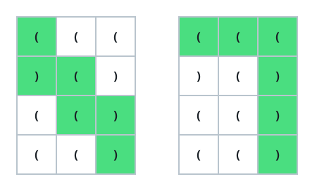
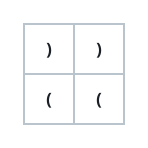

# Balanced Bracket Grid Path

## Description

A bracket string is a non-empty string over the two characters `'('` and
`')'`, and it is balanced when its parentheses close properly: `"()"` is
balanced, joining two balanced strings as `AB` stays balanced, and wrapping
a balanced string as `(A)` stays balanced.

Picture an `m x n` grid in which every cell holds one of those two
characters. A grid path starts at the top-left cell `(0, 0)`, ends at the
bottom-right cell `(m - 1, n - 1)`, and moves only down or right from cell
to cell; reading the visited cells in order spells out one bracket string.

Return `true` if at least one such path spells a balanced bracket string,
and `false` if none does.

### Example 1



```text
Input: grid = [["(","(","("],[")","(",")"],["(","(",")"],["(","(",")"]]
Output: true
Explanation: The diagram highlights two paths whose characters read as
balanced strings: one yields "()(())" and the other yields "((()))".
There may be further balanced paths — finding any single one suffices.
```

### Example 2



```text
Input: grid = [[")",")"],["(","("]]
Output: false
Explanation: Exactly two paths exist, reading "))(" and ")((", and neither
is balanced, so the answer is false.
```

### Constraints

- `m == grid.length`
- `n == grid[i].length`
- `1 <= m, n <= 100`
- `grid[i][j]` is `'('` or `')'`.

## Hints

### Hint 1

For any prefix of a balanced bracket string, what relationship must hold
between how many open and how many close brackets it contains?

### Hint 2

The open-bracket count can never fall below the close-bracket count in any
prefix.

### Hint 3

Dynamic programming over the grid works: let each cell remember every
running balance with which it can be reached.
