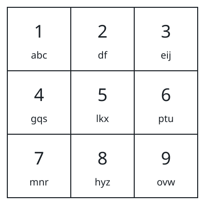
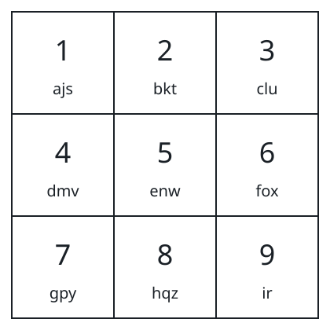

# Minimum Keypad Presses

## Description

Consider a keypad of 9 buttons, numbered 1 through 9. You design the layout
yourself: each of the 26 lowercase letters is assigned to exactly one
button, every button carries at most 3 letters, and the letters on a button
have a fixed order. Typing a letter costs one press per position it holds
on its button — the first letter needs 1 press, the second needs 2, the
third needs 3.

Given a string `s`, return the smallest total number of presses needed to
type `s` out in full, choosing whatever layout is best. Once chosen, the
layout cannot change while typing.

### Example 1



```text
Input: s = "apple"
Output: 5
Explanation: The diagram shows one optimal layout. Each of the five letters
sits in the first slot of its button — 'a' on button 1, 'p' on button 6,
'l' on button 5, and 'e' on button 3 — so every press types one letter.
Five presses in total.
```

### Example 2



```text
Input: s = "abcdefghijkl"
Output: 15
Explanation: The diagram shows one optimal layout. The nine letters 'a'
through 'i' occupy the first slots and cost one press each, while 'j', 'k',
and 'l' sit in the second slots of buttons 1, 2, and 3 and cost two presses
each: 9 + 2 + 2 + 2 = 15.
```

### Constraints

- `1 <= s.length <= 10⁵`
- `s` contains only lowercase English letters.

## Hints

### Hint 1

The letters that occur most often should sit in the first slot of some
button, so each costs a single press.

### Hint 2

Count how often each letter appears, sort those counts from high to low,
and give the top nine letters cost 1, the next nine cost 2, and the rest
cost 3.
