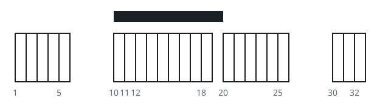
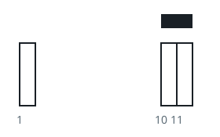

# Best Rug Placement Over White Tiles

## Description

You are given a 2D integer array `tiles` where `tiles[i] = [li, ri]` means
every unit position `j` with `li <= j <= ri` is painted white.

You are also given an integer `rugLen`, the length of a single rug, which
may be laid anywhere along the line and then covers `rugLen` consecutive
positions.

Return the largest number of white positions a single rug placement can
cover.

### Example 1



```text
Input: tiles = [[1,5],[10,11],[12,18],[20,25],[30,32]], rugLen = 10
Output: 9
Explanation: Lay the rug over positions 10 through 19. It fully covers the
two-tile stretch [10,11] and the seven-tile stretch [12,18], nine white
positions in all. Other placements may also reach 9, but none can exceed
it.
```

### Example 2



```text
Input: tiles = [[10,11],[1,1]], rugLen = 2
Output: 2
Explanation: Laying the rug from 10 to 11 covers exactly the two white
positions of [10,11]. A rug placed at the lone tile [1,1] covers only one
position, so 2 is the best possible.
```

### Constraints

- `1 <= tiles.length <= 5 * 10⁴`
- `tiles[i].length == 2`
- `1 <= li <= ri <= 10⁹`
- `1 <= rugLen <= 10⁹`
- The white stretches in `tiles` do not overlap.

## Hints

### Hint 1

Where can an optimal rug's left edge sit? Only positions worth trying are
the left ends of the white stretches.

### Hint 2

With prefix sums and binary search (or a sliding window) you can count how
many white positions fall under any single placement.
