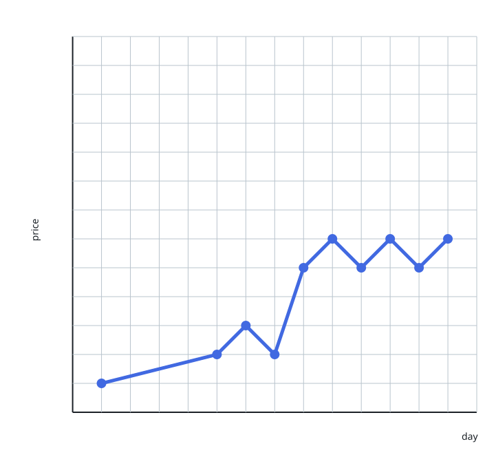
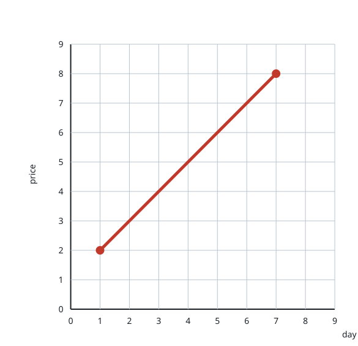

# Fewest Segments to Draw the Curve

## Description

You are given a 2D integer array `stockPrices`, where `stockPrices[i] =
[day, price]` records that the price was `price` on `day`. Plotting each
record as a point — days along the X-axis, prices along the Y-axis — and
joining consecutive points produces a line chart; one such chart is drawn
below:



Long stretches of a chart like this may be perfectly straight, so tracing it
can take far fewer strokes than it has points. Return the minimum number of
straight segments that together trace the whole chart.

### Example 1


```text
Input: stockPrices = [[1,7],[2,6],[3,5],[4,4],[5,4],[6,3],[7,2],[8,1]]
Output: 3
Explanation:
The figure above plots the input, days on the X-axis and prices on the
Y-axis. Three segments trace the chart:
- Segment 1 (in red) from (1,7) to (4,4), covering (1,7), (2,6), (3,5), and (4,4).
- Segment 2 (in blue) from (4,4) to (5,4).
- Segment 3 (in green) from (5,4) to (8,1), covering (5,4), (6,3), (7,2), and (8,1).
Fewer than 3 segments cannot do it: the direction changes at (4,4) and again
at (5,4), so each of the three stretches needs its own segment.
```

### Example 2



```text
Input: stockPrices = [[3,4],[1,2],[7,8],[2,3]]
Output: 1
Explanation:
As the figure above shows, all four plotted points fall on one straight
line, so a single segment covers the entire chart.
```

### Constraints

- `1 <= stockPrices.length <= 10⁵`
- `stockPrices[i].length == 2`
- `1 <= day, price <= 10⁹`
- All days are distinct.

## Hints

### Hint 1

Three neighbouring points stay on one segment exactly when the two steps
between them share a slope — and that can be tested without dividing, by
cross-multiplying the coordinate differences.

### Hint 2

Sort the records by day first (the days are distinct, so the order is
total), then walk the points counting every position where the slope
changes; the answer is that count plus one, with tiny charts needing zero or
one.
