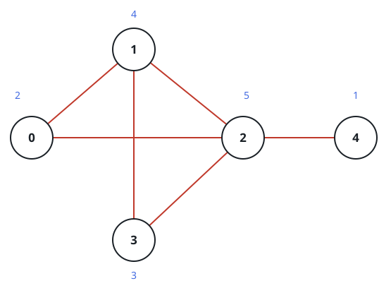
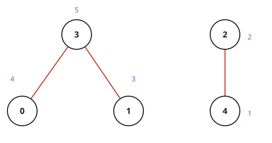

# Peak Prestige of the Road Network

## Description

A country has `n` cities labeled `0` through `n - 1`, connected by
two-way roads: `roads[i] = [ai, bi]` means a road joins city `ai` with
city `bi`.

Every city must receive a distinct prestige rating from `1` to `n`. A
road's prestige is the sum of the ratings at its two ends, and the
network's total prestige is the sum across all roads.

Rate the cities so the total prestige is as large as it can be, and
return that maximum.

### Example 1



```text
Input: n = 5, roads = [[0,1],[1,2],[2,3],[0,2],[1,3],[2,4]]
Output: 43
Explanation: The figure shows the ratings [2,4,5,3,1] given to cities
0 through 4. Each road adds its endpoints' ratings:
- road (0,1): 2 + 4 = 6
- road (1,2): 4 + 5 = 9
- road (2,3): 5 + 3 = 8
- road (0,2): 2 + 5 = 7
- road (1,3): 4 + 3 = 7
- road (2,4): 5 + 1 = 6
Together that is 6 + 9 + 8 + 7 + 7 + 6 = 43, and no rating scheme does
better.
```

### Example 2



```text
Input: n = 5, roads = [[0,3],[2,4],[1,3]]
Output: 20
Explanation: The figure shows the ratings [4,3,2,5,1]. The three roads
contribute 4 + 5 = 9, 2 + 1 = 3, and 3 + 5 = 8, for a total of
9 + 3 + 8 = 20 — the best achievable.
```

### Constraints

- `2 <= n <= 5 * 10^4`
- `1 <= roads.length <= 5 * 10^4`
- `roads[i].length == 2`
- `0 <= ai, bi <= n - 1`
- `ai != bi`
- No pair of cities is joined by more than one road.

## Hints

### Hint 1

A road bills both of its endpoint cities, so a city's share of the
total is its rating multiplied by the number of roads touching it.

### Hint 2

That points to the ordering: sort cities by how many roads touch them
and hand out the ratings `1..n` in that same order.
