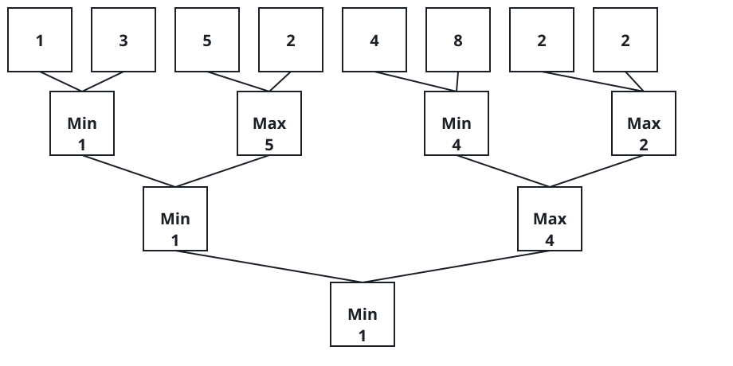

# Shrink to One

## Description

You are given a 0-indexed integer array `nums` whose length is a power of
two. The array is compressed over and over, halving in size each round,
until a single value remains.

One compression round works like this: walk the current array two elements
at a time, filling a new array of half the length. Position `i` of the new
array holds the smaller of `nums[2 * i]` and `nums[2 * i + 1]` when `i` is
even, and the larger of the two when `i` is odd. The new array then becomes
the current array, and the next round starts from it.

Return the one value that is left once the array has been compressed down
to a single element.

### Example 1



```text
Input: nums = [1,3,5,2,4,8,2,2]
Output: 1
Explanation:
The diagram traces the compression round by round:
Round 1: [1,5,4,2]
Round 2: [1,4]
Round 3: [1]
The single value left is 1.
```

### Example 2

```text
Input: nums = [10,2,7,5,6,3,8,4]
Output: 2
Explanation:
The rounds are `[2,7,3,8]`, then `[2,8]`, and finally `[2]`.
```

### Example 3

```text
Input: nums = [12,4,9,1]
Output: 4
Explanation:
Round 1 gives `[4,9]`: index 0 takes the smaller of `12, 4`, and index 1
takes the larger of `9, 1`. Round 2 then gives `[4]`.
```

### Example 4

```text
Input: nums = [42]
Output: 42
Explanation:
A one-element array is already done, so the answer is 42.
```

### Constraints

- `1 <= nums.length <= 1024`
- `1 <= nums[i] <= 10⁹`
- `nums.length` is a power of two.

## Hints

### Hint 1

The rounds are so cheap to replay directly that no cleverness is required:
just build the half-length array as described and loop.

### Hint 2

Because the length halves every round, the total number of elements ever
processed is `n + n/2 + n/4 + ...`, so the whole run finishes in a handful
of rounds — O(log n) of them.
