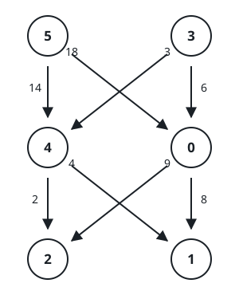

# Cheapest Grid Descent

## Description

You are given an `m x n` matrix `grid` whose cells hold the distinct integers
from `0` to `m * n - 1` in some arrangement. A walk descends this matrix:
from a cell in row `x` with `x < m - 1` it may step to any cell of row
`x + 1`, whatever the column, and the walk ends once it reaches the last row.

Stepping is not free. A second matrix `moveCost`, sized `(m * n) x n`, prices
every step: `moveCost[i][j]` is charged when a walk leaves a cell whose value
is `i` and lands in column `j` of the row below. Steps out of the last row
never happen.

A walk's total is the sum of the values written in every cell it visits plus
the sum of its step prices. Starting from any cell of the first row and
finishing in the last row, return the smallest total a walk can achieve.

### Example 1



```text
Input: grid = [[5,3],[4,0],[2,1]], moveCost = [[9,8],[1,5],[10,12],[18,6],[2,4],[14,3]]
Output: 17
Explanation: The cheapest walk reads 5 -> 0 -> 1. Its cells contribute
5 + 0 + 1 = 6, and its steps cost moveCost[5][0] = 3 and moveCost[0][1] = 8,
so the walk totals 6 + 3 + 8 = 17.
```

### Example 2

```text
Input: grid = [[2,5,0],[3,1,4]], moveCost = [[4,8,6],[9,3,7],[5,2,9],[1,8,7],[6,5,2],[2,9,4]]
Output: 5
Explanation: The walk 2 -> 1 collects cell values 2 + 1 = 3 and pays
moveCost[2][1] = 2 for its single step, for a total of 5.
```

### Example 3

```text
Input: grid = [[4,2],[0,5],[3,1]], moveCost = [[3,9],[8,4],[6,1],[7,5],[4,8],[9,3]]
Output: 12
Explanation: The walk 2 -> 5 -> 1 gathers values 2 + 5 + 1 = 8 and pays steps
moveCost[2][1] = 1 and moveCost[5][1] = 3, reaching a total of 12.
```

### Constraints

- `m == grid.length` and `n == grid[i].length`
- `2 <= m, n <= 50`
- `grid` holds each integer from `0` to `m * n - 1` exactly once.
- `moveCost` has `m * n` rows of `n` entries each.
- `1 <= moveCost[i][j] <= 100`

## Hints

### Hint 1

Once you know the cheapest total for arriving at every cell of one row, what
does it cost to push each of those totals one row further down?

### Hint 2

Sweep the rows top to bottom while carrying one best-total-per-column table;
once the last row is reached, the answer is its smallest entry.
