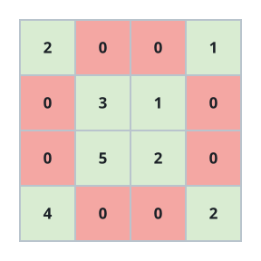
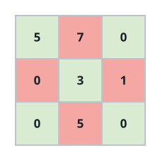

# Is This A Cross Matrix

## Description

Give a square matrix the name cross matrix when two rules hold at once:

- every cell on either of the two diagonals carries a non-zero value;
- every cell off both diagonals holds exactly 0.

You are given an `n x n` integer matrix `grid`. Report whether it forms a
cross matrix: return `true` if it does, and `false` if it breaks either
rule anywhere.

### Example 1



```text
Input: grid = [[2,0,0,1],[0,3,1,0],[0,5,2,0],[4,0,0,2]]
Output: true
Explanation: In the diagram the highlighted diagonal cells are exactly the
non-zero ones. Both diagonals are fully non-zero and the remaining cells
are all zero, so this is a cross matrix.
```

### Example 2



```text
Input: grid = [[5,7,0],[0,3,1],[0,5,0]]
Output: false
Explanation: Two rules break here: the 7 in the top row sits off both
diagonals, and the bottom-right corner, which lies on a diagonal, is 0.
```

### Example 3

```text
Input: grid = [[3,0,0,7],[0,9,8,0],[0,6,2,0],[1,0,0,4]]
Output: true
Explanation: The two diagonals carry 3, 9, 2, 4 and 7, 8, 6, 1 — all
non-zero — and every other cell is 0.
```

### Constraints

- `n == grid.length == grid[i].length`
- `3 <= n <= 100`
- `0 <= grid[i][j] <= 10⁵`

## Hints

### Hint 1

Number rows and columns from 0. A cell `(i, j)` lies on a diagonal exactly
when `i == j` or `i + j == n - 1`.

### Hint 2

One sweep over all cells is enough: demand a non-zero value from diagonal
cells, demand zero from everyone else, and fail on the first cell that
disobeys.
