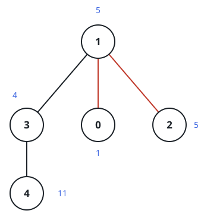
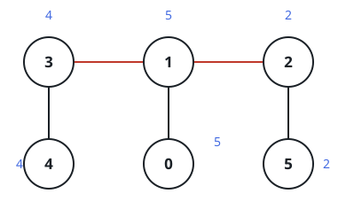

# Tightest Tree Split

## Description

A tree with n nodes, labeled 0 through n - 1, is connected by exactly
n - 1 edges.

Node i carries the value `nums[i]`, and `edges[i] = [ai, bi]` records that
nodes `ai` and `bi` are joined by an edge. Both arrays are 0-indexed.

Cut two different edges. The tree falls into three connected components,
and the pair of cuts is scored by the spread of the component XORs: take
the XOR of every node value inside each component, then subtract the
smallest of the three results from the largest.

For example, suppose the three components hold the values [5,3], [12],
and [7,7,7]. Their XORs are 5 ^ 3 = 6, 12, and 7 ^ 7 ^ 7 = 7, so this
pair of cuts scores 12 - 6 = 6.

Return the smallest score any choice of two edges can achieve.

### Example 1



```text
Input: nums = [1,5,5,4,11], edges = [[0,1],[1,2],[1,3],[3,4]]
Output: 9
Explanation: In the layout drawn above, dropping the two marked edges
leaves one component of nodes {1,3,4} carrying values [5,4,11], plus the
singletons {0} carrying [1] and {2} carrying [5]. The XORs are
5 ^ 4 ^ 11 = 10, 1, and 5, and 10 - 1 = 9. No other pair of cuts brings
the three XORs closer together.
```

### Example 2



```text
Input: nums = [5,5,2,4,4,2], edges = [[0,1],[1,2],[5,2],[4,3],[1,3]]
Output: 0
Explanation: As the diagram shows, a suitable pair of cuts separates the
node sets {3,4}, {0,1}, and {2,5}, whose values [4,4], [5,5], and [2,2]
each XOR to 0. Three equal XORs leave a spread of 0, and no score can be
negative, so this is optimal.
```

### Example 3

```text
Input: nums = [13,6,11,11], edges = [[0,1],[1,2],[2,3]]
Output: 0
Explanation: Cutting the last two edges of the chain splits it into
{0,1}, {2}, and {3}, with XORs 13 ^ 6 = 11, 11, and 11. All three agree,
so the score is 0 — a value no arrangement can beat.
```

### Constraints

- `n == nums.length`, and `edges` holds `n - 1` pairs of endpoints
- `3 <= n <= 1000`
- `1 <= nums[i] <= 10⁸`
- each `edges[i]` has exactly two entries, `0 <= ai, bi < n`, `ai != bi`
- the edges form a valid tree

## Hints

### Hint 1

Settle the first cut before worrying about the second. Once one edge is
removed, every remaining decision plays out inside the two pieces that
edge separates — think about what can be precomputed for both pieces in
one pass.

### Hint 2

Root the tree and record, for every node, the XOR of its entire subtree.
With those values stored, each of the three component XORs for any pair
of cuts is either a single stored subtree XOR or a fixed small
combination of them.
