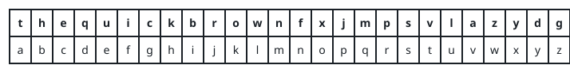

# Recover the Hidden Text

## Description

You are given two strings, `key` and `message`: a cipher key and a
scrambled text. The text is recovered like this:

- Read `key` from left to right. The first time a lowercase letter
  appears, hand it the next unused letter of the alphabet, starting at
  'a'. These pairings form the substitution table.
- Replace every letter of `message` with whatever the table pairs it
  with.
- A space ' ' stands for itself.

For instance, if `key` began `"sunny meadow"`, the first appearances
would give the opening of the table: 's' -> 'a', 'u' -> 'b', 'n' -> 'c',
'y' -> 'd', 'm' -> 'e', 'e' -> 'f'.

Return the recovered `message`.

### Example 1



```text
Input: key = "the quick brown fox jumps over the lazy dog", message = "vkbs bs t suepuv"
Output: "this is a secret"
Explanation: Taking each letter's first sighting in the key and lining
those up with 'a', 'b', 'c', ... builds exactly the table drawn above.
Reading `message` through it spells out the hidden sentence.
```

### Example 2


```text
Input: key = "eljuxhpwnyrdgtqkviszcfmabo", message = "zwx hnfx lqantp mnoeius ycgk vcnjrdb"
Output: "the five boxing wizards jump quickly"
Explanation: The table pictured above comes from walking the key once
and pairing each newly seen letter with the next alphabet letter in
line. Translating `message` with it recovers the plaintext shown.
```

### Example 3

```text
Input: key = "zyxwvutsabcoeflghrijkmdnpq", message = "svool dlrow"
Output: "hello world"
Explanation: The key opens with z, y, x, ..., so its first appearances
assign z -> 'a', y -> 'b', x -> 'c', and onward. Reading `message`
through that table turns "svool dlrow" into "hello world".
```

### Example 4

```text
Input: key = "pack my box with five dozen liquor jugs", message = "wqbn avj"
Output: "jugs box"
Explanation: The key's first sightings fill the table starting p -> 'a',
a -> 'b', c -> 'c', k -> 'd'. Under that table w decodes to j, q to u,
b to g, and n to s, so `wqbn avj` reads back as "jugs box".
```

### Constraints

- `26 <= key.length <= 2000`
- `key` is made of lowercase English letters and spaces `' '`
- `key` contains every letter from 'a' to 'z' at least once
- `1 <= message.length <= 2000`
- `message` is made of lowercase English letters and spaces `' '`

## Hints

### Hint 1

Walk the key once, handing each letter you have never seen before the
next alphabet letter in line.

### Hint 2

Only the first sighting of a letter earns a table entry, so skip any
letter that is already mapped.

### Hint 3

Translate `message` one character at a time through the finished table,
letting spaces pass straight through.
