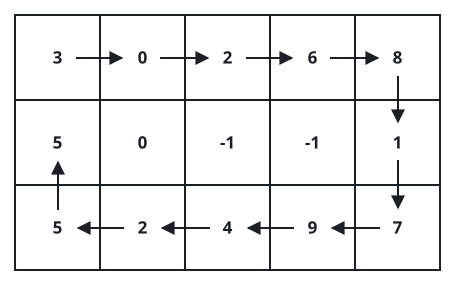
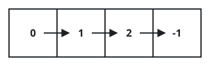

# Spiral Grid Fill IV

## Description

You are given two integers `m` and `n`, the row and column counts of a
grid, together with the head of a linked list holding integers.

Pour the list's values into the grid following a clockwise spiral path
that starts at the top-left cell. If the list runs out before every cell
is written, any leftover cells are marked `-1`.

Return the finished grid.

### Example 1



```text
Input: m = 3, n = 5, head = [3,0,2,6,8,1,7,9,4,2,5,5,0]
Output: [[3,0,2,6,8],[5,0,-1,-1,1],[5,2,4,9,7]]
Explanation: The diagram above traces the order in which the values land
in the grid. Cells the list never reaches are filled with -1.
```

### Example 2



```text
Input: m = 1, n = 4, head = [0,1,2]
Output: [[0,1,2,-1]]
Explanation: The diagram above shows the values laid in left to right;
the single cell the list never reaches is set to -1.
```

### Example 3

```text
Input: m = 2, n = 2, head = [9,8,7,6]
Output: [[9,8],[6,7]]
Explanation: The four values run once around the ring: across the top
9, 8, then down and back along the bottom 7, 6.
```

### Example 4

```text
Input: m = 2, n = 3, head = [10,20,30,40,50]
Output: [[10,20,30],[-1,50,40]]
Explanation: The top row takes 10, 20, 30 left to right, the path turns,
and 40, 50 are written right to left along the bottom. The list is
exhausted before the last bottom cell, which stays -1.
```

### Constraints

- `1 <= m, n <= 10⁵`
- `1 <= m * n <= 10⁵`
- the list holds between `1` and `m * n` nodes
- `0 <= Node.val <= 1000`

## Hints

### Hint 1

Initialize every cell to -1 up front, so positions the list never
reaches are already correct.

### Hint 2

Carry a direction step with you. From the current cell, advance only if
the next cell lies inside the grid and still holds -1.

### Hint 3

When you cannot advance, rotate the direction a quarter turn clockwise
and keep walking until the list is empty.
