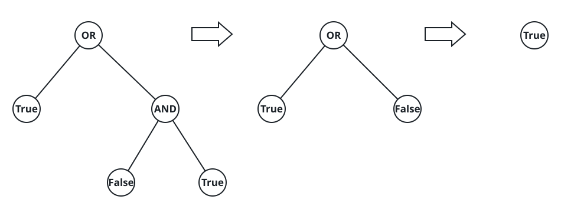

# Formula Tree

## Description

Here a boolean formula is written as a binary tree. Each leaf of the tree
holds a literal — `0` meaning false, `1` meaning true — and each internal
node holds an operator: `2` is logical OR, `3` is logical AND. The tree is
_full_, meaning every node has either no children or exactly two; a node
with no children is a leaf.

A node evaluates as follows:

- A leaf evaluates to the literal it carries.
- An internal node evaluates both of its children first, then applies its
  own operator to those two results.

Return the boolean value that the root evaluates to.

### Example 1



```text
Input: root = [2,1,3,null,null,0,1]
Output: true
Explanation: The two leaves under the AND node carry 0 and 1, so that
subtree evaluates to false. The OR node combines its own leaf, 1, with
that false: true OR false = true, which is what the root returns.
```

### Example 2

```text
Input: root = [3,0,0]
Output: false
Explanation: The AND node sees false from both of its leaves, so the root
evaluates to false.
```

### Example 3

```text
Input: root = [2,3,2,1,0,1,0]
Output: true
Explanation: The left subtree ANDs 1 with 0 into false, the right subtree
ORs 1 with 0 into true, and the root ORs the two results into true.
```

### Constraints

- The tree contains between 1 and 1000 nodes.
- Every node value lies in the range `[0, 3]`.
- Each node has either zero or two children.
- A leaf's value is `0` or `1`; an internal node's value is `2` or `3`.

## Hints

### Hint 1

A node's value depends only on its two subtrees, so one depth-first walk
that finishes both children before handling the parent — a post-order
traversal — evaluates the whole tree.

### Hint 2

Recursion is the natural sketch, but a full tree of 1000 nodes can still
form a spine hundreds of levels deep; consider folding the values with an
explicit stack if that depth is a concern.
