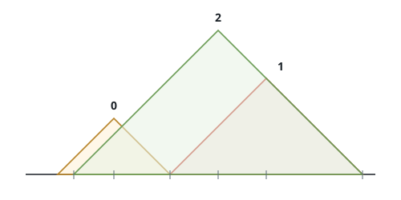
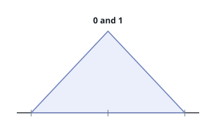

# Counting Uncovered Summits

## Description

Every entry of the 0-indexed array `peaks` describes one mountain:
`peaks[i] = [xi, yi]` puts mountain `i`'s summit at point `(xi, yi)`. Each
mountain occupies a right isosceles triangle standing on the x-axis with
its right angle at the summit — in other words, both slopes rise and fall
at 45 degrees (gradients `1` and `-1`).

A summit counts as uncovered when it is not contained in any other
mountain's triangle, with the boundary counting as containment: a point
sitting exactly on a neighbor's slope is covered.

Return how many of the mountains have an uncovered summit.

### Example 1



```text
Input: peaks = [[2,2],[6,3],[5,4]]
Output: 2
Explanation: The picture sketches all three mountains.
- Mountain 0 stays uncovered: nothing else encloses its summit.
- Mountain 1 is covered because its summit sits on mountain 2's slope.
- Mountain 2 stays uncovered as well.
So 2 summits are uncovered.
```

### Example 2



```text
Input: peaks = [[1,3],[1,3]]
Output: 0
Explanation: The picture shows the two mountains stacked exactly on top
of each other. Each summit lies inside the other mountain, so neither
counts.
```

### Example 3

```text
Input: peaks = [[4,4],[6,2],[9,5]]
Output: 2
Explanation: Mountain 1's summit at (6,2) lies exactly on mountain 0's
right slope — the boundary still covers it — while mountains 0 and 2
enclose nothing but themselves. The answer is 2.
```

### Constraints

- `1 <= peaks.length <= 10⁵`
- `peaks[i].length == 2`
- `1 <= xi, yi <= 10⁵`

## Hints

### Hint 1

For one summit to be covered by another mountain, that covering mountain
only ever comes from a limited neighborhood — think about what the 45°
slopes imply for which pairs can interact at all.

### Hint 2

Order the points left to right (and when x ties, take the taller one
first); in that order, a summit's only remaining candidate coverer is
the strongest one seen so far.

### Hint 3

Keep the survivors of the sweep on a stack that stays strictly better
left to right, and remember that two identical entries cover each other
even though neither eliminates the other mid-sweep.
